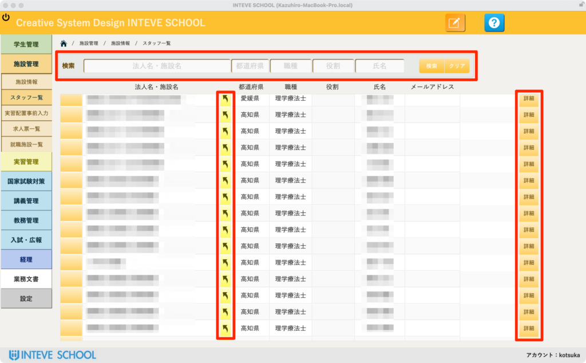
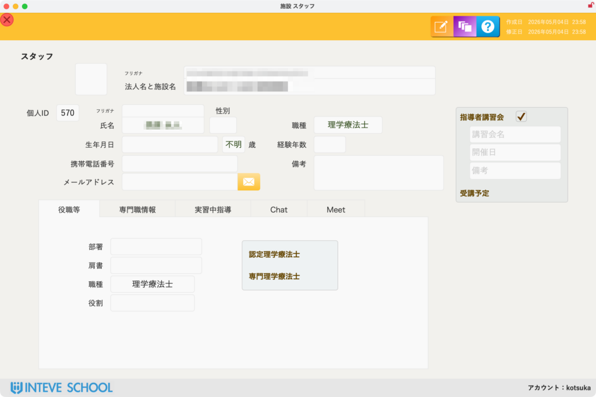

[← 施設管理ポータルに戻る](施設管理ポータル.md) | [メインページ](top.md)

# 施設情報 スタッフ 一覧

## 施設情報 スタッフ一覧の使いかた

各実習施設に所属しているすべての指導者、連絡担当者、事務スタッフ等の情報を全施設横断で検索・確認する画面です。

### 🔍 1. スタッフの検索と絞り込み

画面上部の検索エリア（赤枠部分）を使って、特定の条件に合致するスタッフを迅速に検索できます。

- **法人名・施設名、都道府県、職種、役職、氏名：** 必要な条件を入力または選択し、右端の「検索」ボタンをクリックします。全件表示に戻す場合は「クリア」をクリックします。

### 🔀 2. 詳細画面へのジャンプと確認

- 各行の右端にある **「詳細」ボタン**（画像1枚目の赤枠部分）または「黄色い矢印ボタン」をクリックすると、個別の「施設スタッフ（詳細情報）」画面（画像2枚目）がポップアップ、または画面遷移で開きます。
- 💡 **ポイント：** この詳細画面で確認できる項目やタブの構成（専門職情報、実習指導書、Chat、Meetなど）は、別途用意している「スタッフ管理マニュアル」内の詳細ページと共通の仕様です。
- *(※詳細な入力・変更手順については、こちらの【[スタッフ情報詳細マニュアル](施設情報-スタッフ.md)】をご覧ください)*

### 📝 3. 施設スタッフ詳細の主な確認項目

詳細画面では、該当スタッフの以下のような実務に直結するステータスを確認できます。

- **基本属性・連絡先：** 氏名、生年月日、職種（理学療法士等）、携帯番号、メールアドレスなど。
- **指導者講習会受講ステータス：** 「指導者講習会」の受講履歴や、今後の受講予定状況が一目で分かります。
- **各種所属・認定情報：** 画面下部のタブを切り替えることで、詳細な役職や取得している専門資格（認定理学療法士など）、外部ツール（Google Chat / Meet）の連携状況を確認できます。

---
[← 施設管理ポータルに戻る](施設管理ポータル.md) | [メインページ](top.md)
