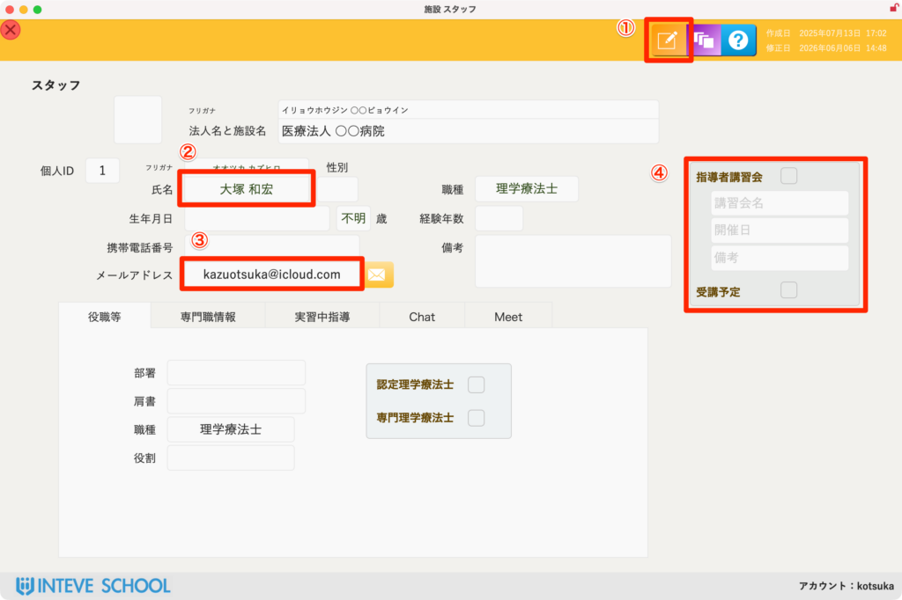
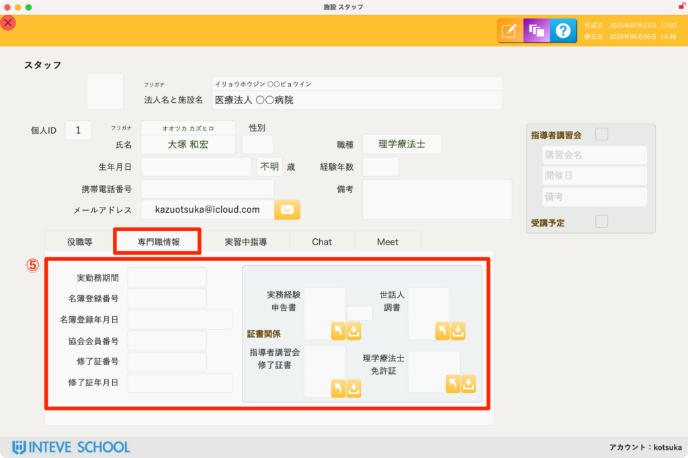
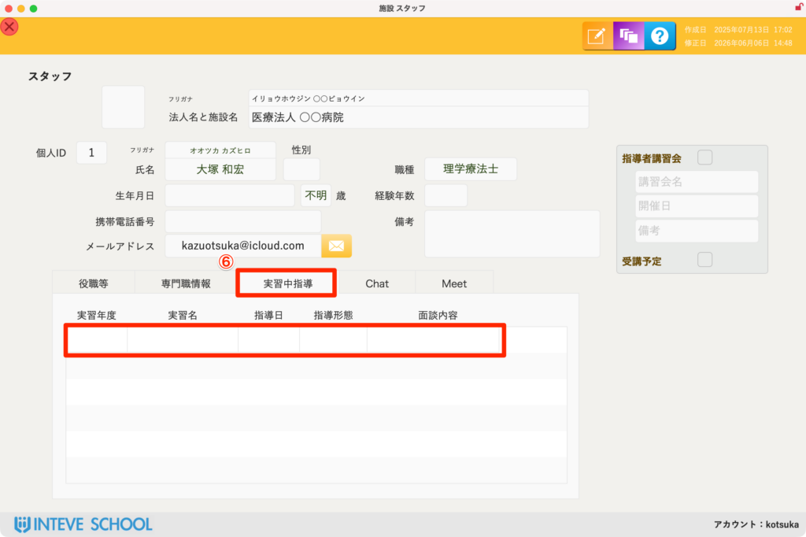
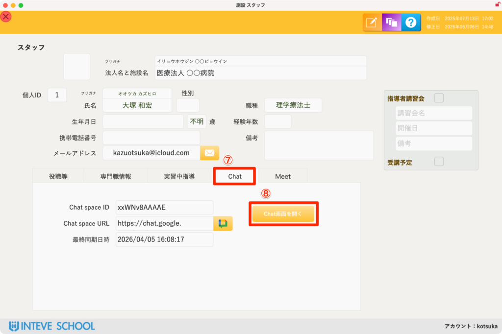
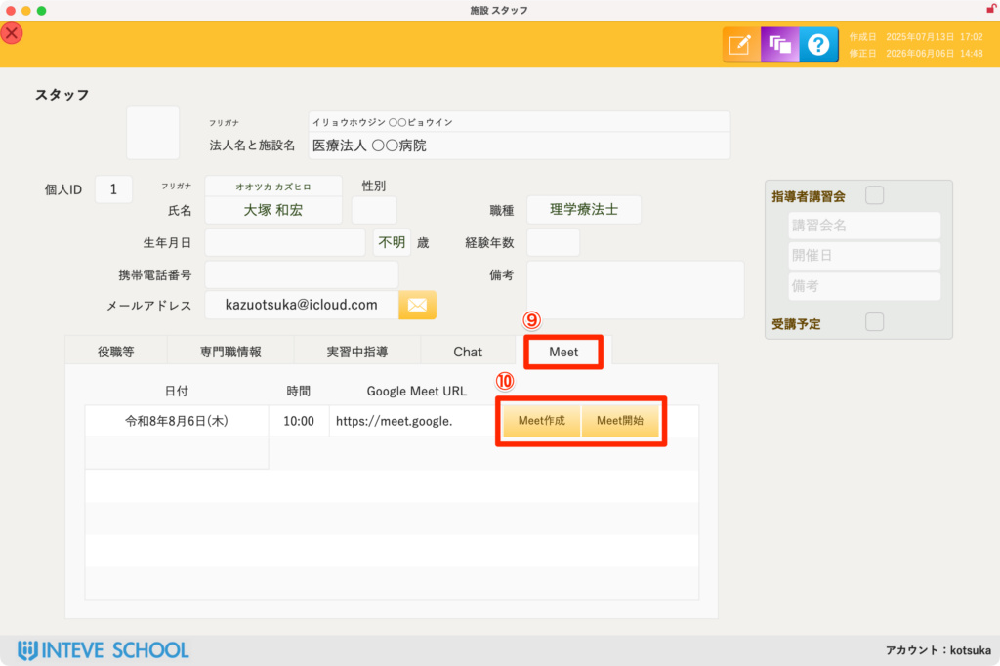

[← 施設管理ポータルに戻る](施設管理ポータル.md) | [メインページ](top.md)

# 施設情報 スタッフ 詳細

## 👤 施設情報 スタッフ詳細の使いかた

スタッフ個人の詳細情報の管理と、実習中の公式な連絡をスムーズに行うための画面です。 学校のオフィシャルなやり取りとして、LINEは不適切であり、メールは堅苦しくなりがちです。実務におけるスピード感と手軽さのバランスを考慮し、本システムでは **Google ChatおよびMeet** との連携機能を搭載しています。

### 🚨 ① 編集モードへの切り替え

画面内の情報を追加・修正する場合は、必ず右上の編集ボタンをクリックしてから作業を行ってください。

- *(※詳細な手順は【[編集モードの基本操作](編集モードへ.md)】をご覧ください)*

### 📝 ② 基本情報の登録（必須項目）

最低限「名前」さえ登録されていれば、実習中の指導者としてシステムに割り当てることができるようになります。

### 📧 ③ メールアドレスの重要性

登録されたメールアドレスは、単なる連絡先としてだけでなく、後述する **Google ChatやMeetを動かすための必須キー** となります。

### 📜 ④ 指導者講習会の受講ステータス

養成校のルール上、指導者講習会を受講済みのスタッフが施設に最低1名は在籍していないと、実習指導をお願いすることができません。非常に重要なフィールドです。

- 詳細な講習会名や開催日を入力できますが、最低限チェックボックスに **チェックを入れるだけ** でもシステムは受講済みとして認識します。

### 🎖️ ⑤ 専門職情報・証明書の保管（学校監査対策）

「名簿登録年月日」を入力しておくことで、スタッフの経験年数が自動計算で算出されます。

- 療法士の免許証や講習会の修了証書を画像（オブジェクト）として直接保管できます。
- これは**第三者機関による学校監査（査察）の際に提出を求められる必須情報**です。日頃からここに集約しておくことで、監査直前に慌てて書類を探す手間を完全に無くせます。

### ⏳ ⑥ 実習中指導（指導履歴の確認）

過去に「いつ」「どの学生の」実習を担当し、どのような指導を行っていたかの履歴を一覧で確認できます。

- 基本は閲覧ベースですが、ここから直接編集することも可能です。
- *(※メインの編集画面は別にあります。詳細は【[実習指導履歴管理](実習管理-実習中指導.md)】をご覧ください)*

### 💬 ⑦ ⑧ Google Chat連携

正しいメールアドレスが登録されていると、⑧の「Chat画面を開く」ボタンが有効になります。

- **初回のみ：** 連動させるための Chat space ID や URL が入力されるまで少し認証が必要です（数秒で終わります）。一度設定してしまえば、以降はボタンを押すだけで瞬時にブラウザが立ち上がり、該当スタッフとの専用Chat画面が開きます。

### 📹 ⑨ Google Meet連携（オンライン面談・指導）

実習中のオンライン巡回実習中面談などに利用できる、Google Meetの発行画面です。

- 「日付」と「時間」を入力するとボタンがアクティブになります。
- **Meet作成：** クリックすると、Googleカレンダーに自動でスケジュールが登録されます。
- **Meet開始：** ブラウザで対象のMeetルームが即座に開始されます。

---
[← 施設管理ポータルに戻る](施設管理ポータル.md) | [メインページ](top.md)
