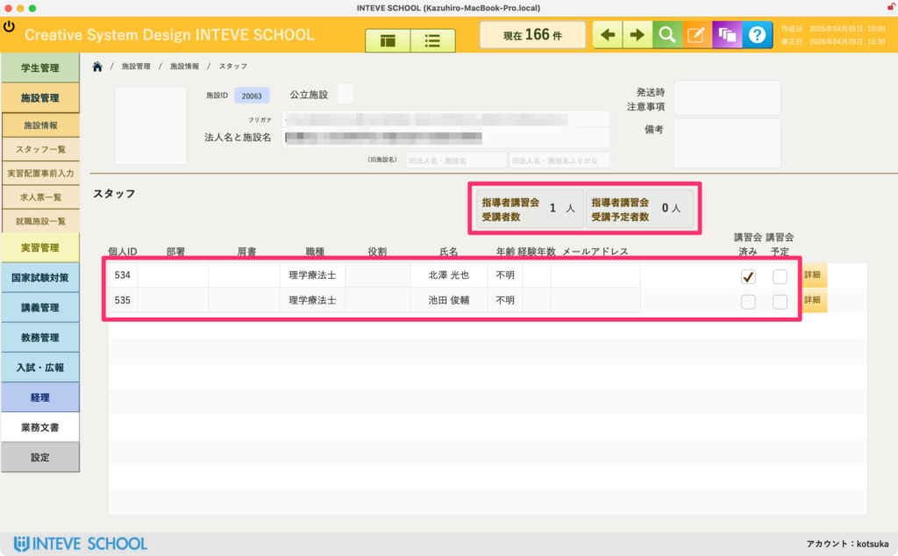
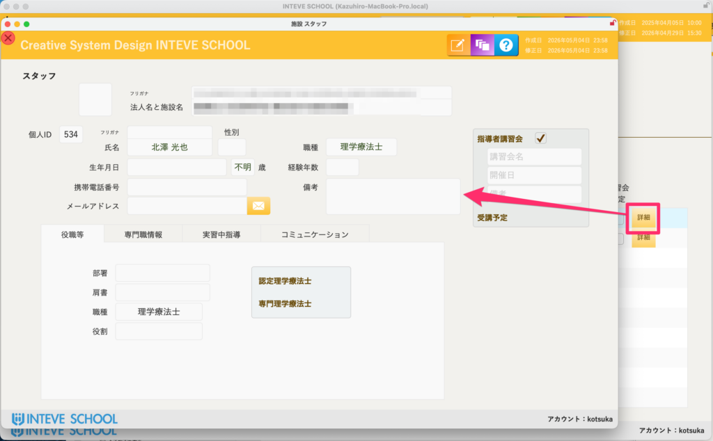

[← 施設管理ポータルに戻る](施設管理ポータル.md) | [メインページ](top.md)

# 施設情報 スタッフ

## 👥 施設情報 スタッフの使いかた

施設に所属するスタッフ（スーパーバイザーや卒業生など）の情報を個別に管理する画面です。ここで蓄積されたデータは、実習生の指導者を割り当てる際の重要な判断材料となります。

### 📊 指導者講習会の受講者数（実習配置の必須情報）

画面上部には、その施設に所属するスタッフのうち **「指導者講習会受講者数」** と **「指導者講習会受講予定者数」** の合計が自動集計されて表示されます。

- 養成校の実習配置において、厚生労働省のガイドラインを満たす指導者が何名在籍しているかは必須の情報です。これらを一元管理し、常に最新の状態に蓄積しておく必要があります。

### 📋 スタッフ一覧と指導者の紐付け

所属スタッフの「個人ID」「部署」「職種（理学療法士など）」「氏名」「経験年数」「メールアドレス」が一覧で確認できます。

- **実習指導者の選定：** 実習を割り当てる際、この一覧に登録されているスタッフの情報を元にして、実習中の学生指導者（バイザー）のデータを直接引っ張ってくる仕組みになっています。
- **講習会受講チェック：** 各スタッフの右側にある「講習会済み」「講習会予定」のチェック状態が、上部の合計人数および実習配置のロジックに直結します。受講が確認できたら速やかに反映させてください。

### 🔍 各スタッフの詳細情報の入力・確認

スタッフ個人のより詳細な情報（過去の指導履歴や連絡先詳細など）を入力・確認する場合は、各行の右端にあるボタンから詳細ページへ移動します。

- *(※詳細ページの具体的な操作手順については、こちらの【[スタッフ詳細マニュアルへ](施設情報-スタッフ-詳細.md)】をご覧ください)*

---
[← 施設管理ポータルに戻る](施設管理ポータル.md) | [メインページ](top.md)
