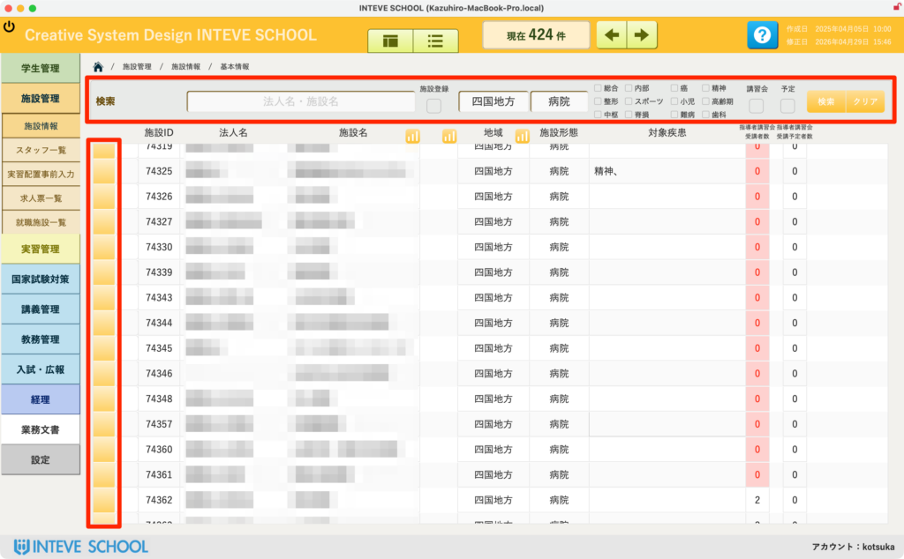

[← 施設管理ポータルに戻る](施設管理ポータル.md) | [メインページ](top.md)

# 施設情報 一覧

## 📋 施設情報 一覧の使いかた

登録されているすべての実習施設の基本情報を俯瞰し、目的の施設を検索して個別詳細ページへ移動するための、施設管理の基本となる画面です。

### 🔍 1. 施設の検索と絞り込み（画面上部：赤枠部分）

多数の登録施設から、必要な施設を複数の条件で瞬時に絞り込むことができます。

- **法人名・施設名：** テキストを入力して部分一致で検索できます。
- **地域・施設形態・対象疾患：** ドロップダウンやチェックボックス（総合、内部、脳、精神など）を組み合わせて、実習先の条件に合う施設を抽出できます。
- **講習会・予定：** 指導者講習会の受講者数や予定者数に基づく絞り込みも可能です。
- 💡 **操作：** 条件を入力・選択後、右端の「検索」ボタンをクリックします。全件表示に戻したい場合は「クリア」をクリックしてください。

### 🔀 2. 個別詳細ページへのジャンプ（画面左端：縦の赤枠部分）

- 各行の左端にある **「黄色い四角ボタン（ジャンプボタン）」** をクリックすると、その施設の詳細情報画面（マスタ画面）へ直接移動します。
- ⚠️ **新規登録を行う前の注意：** 新しい施設をシステムに登録する際は、データの重複を防ぐため、必ず事前にこの一覧画面で「法人名・施設名」を検索し、すでに登録されていないかを確認してから手続きを行ってください。

---
[← 施設管理ポータルに戻る](施設管理ポータル.md) | [メインページ](top.md)
