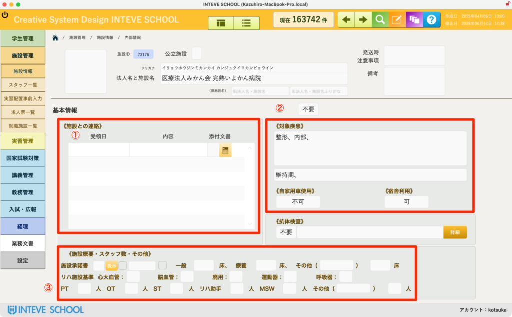
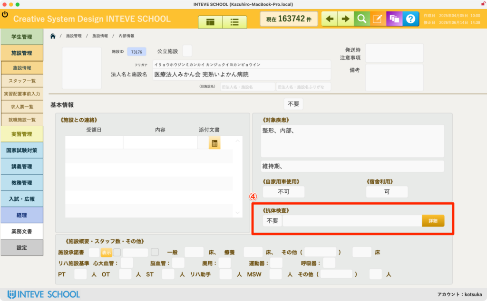
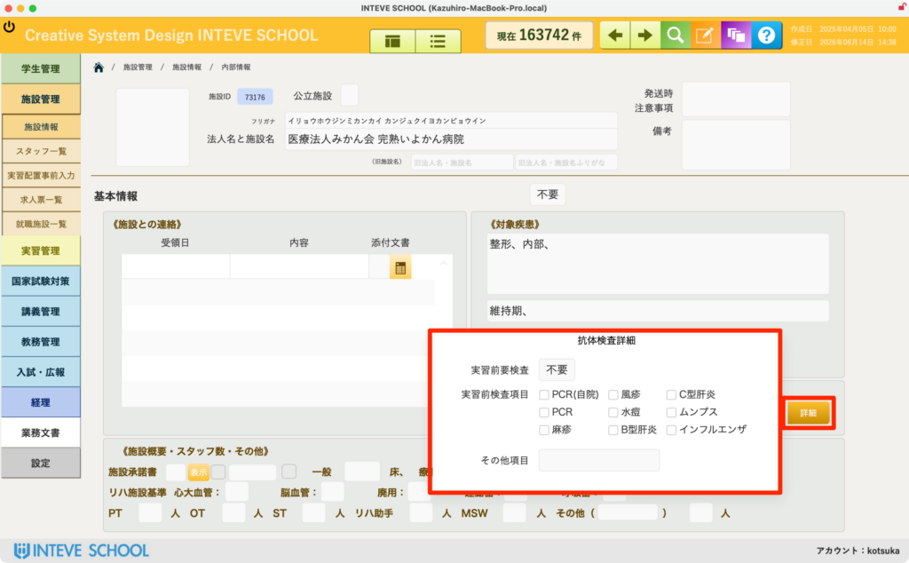

[← 施設管理ポータルに戻る](施設管理ポータル.md) | [メインページ](top.md)

# 施設情報 内部情報

## 🔒 施設情報 内部情報の使いかた

施設との過去のやり取りや、実習地を選定する際に極めて重要となる「学校独自の内部情報」を管理する画面です。

🚨 **【重要】編集を行う前の必須操作** この画面の情報を追加・修正する場合は、必ず画面右上にある **「[編集ボタン（鉛筆マーク）](編集モードへ.md)」** をクリックして、編集可能状態に切り替えてから入力を行ってください。

### 📅 ① 施設との連絡（やり取り履歴）

施設といつ、どのようなやり取り（電話・メール・面談など）を行ったかの履歴を記録・確認できます。

- 担当者の記憶に頼ることで発生しがちだった「言った・言わない」の混乱を防ぎ、教職員全体で正確な経緯を共有できます。

### 🏥 ② 対象疾患・条件（実習配置の参考情報）

学生を実習地に配置（割り当て）する際に、必ず参考にする重要な情報です。

- **「対象疾患」**（例：整形、中枢など）のほか、**「自家用車使用」「宿舎利用」** の可否といった、学生の配属可否に直結する受入条件を管理します。
- 施設からの提出書類や、個別のヒアリングで得た最新の情報をここに集約します。

### 👥 ③ 施設概要・スタッフ数・その他

施設の規模やリハビリスタッフの在籍状況を確認するエリアです。

- 施設の病床数や、PT（理学療法士）・OT（作業療法士）・ST（言語聴覚士）などの正確な人数を把握することで、適切な指導環境があるかを客観的に判断できます。

### 💉 ④ 抗体検査項目の登録（自動判定エリア）

画面右側の【抗体検査】エリアは、実習生一覧画面での「抗体検査必須施設の抽出」に連動する重要な項目です。

- **自動切り替え仕様:** 初期状態では「不要」と表示されていますが、下部のチェックボックス（麻疹、風疹、水痘、ムンプス、B型肝炎、インフルエンザなど）に**何かしらの情報を入力（チェック）すると、システムが自動的に『必要』へと表示を切り替えます。**
- **入力の手順:**
    1. 該当する実習前抗体検査のチェックボックス（例：麻疹、風疹など）に必要なチェックを入れます。
    2. チェックを入れると、上部のステータスが自動的に「必要」に変わります。
    3. 画面を移動（遷移）すると、入力データは自動的に保存されます。

---
[← 施設管理ポータルに戻る](施設管理ポータル.md) | [メインページ](top.md)
