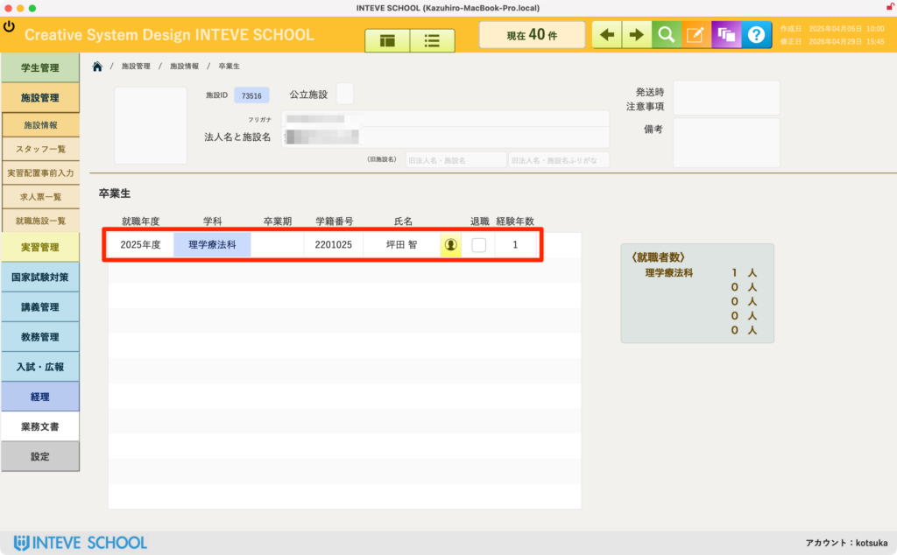
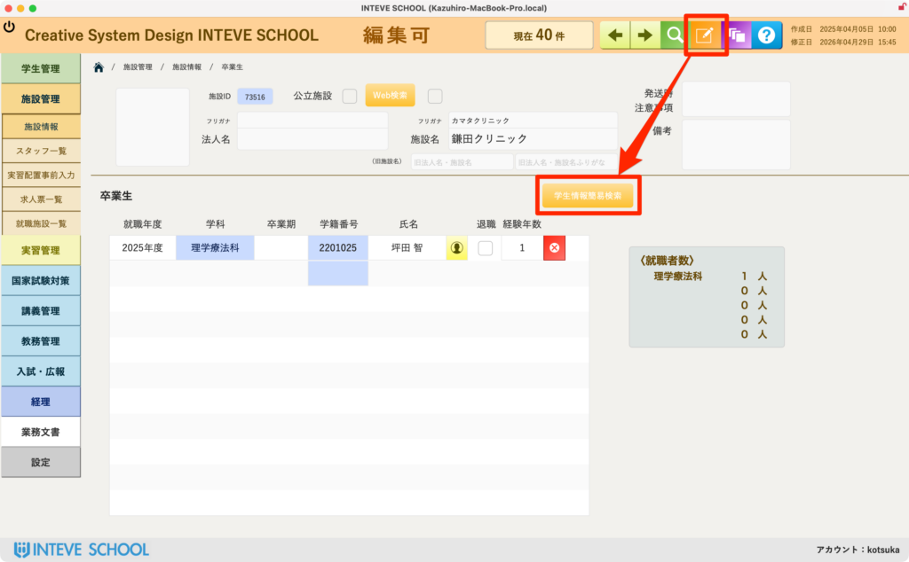
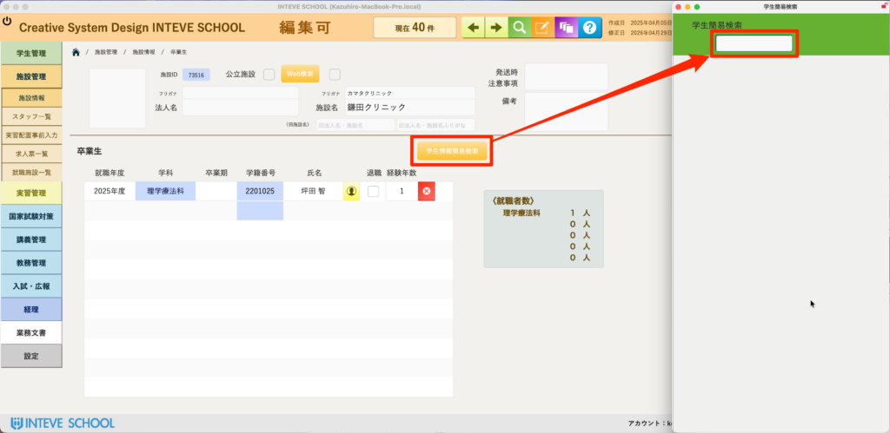
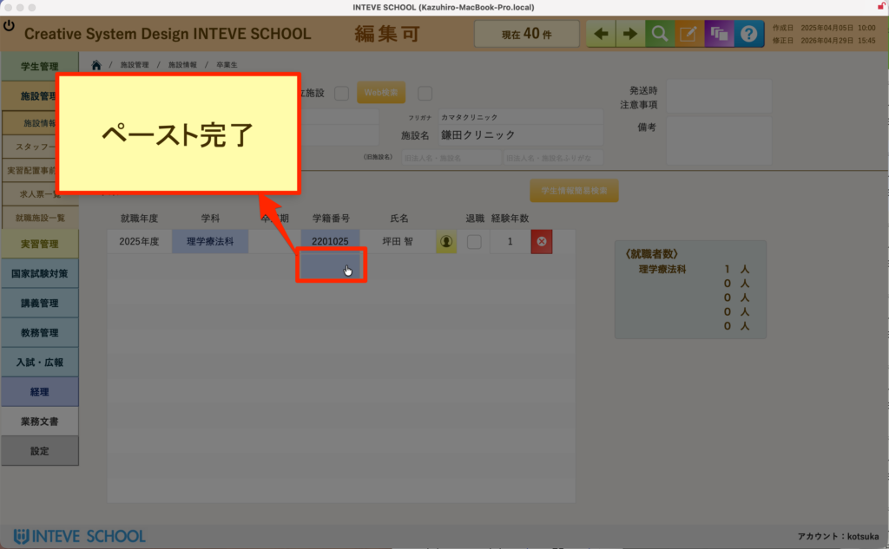

[← 施設管理ポータルに戻る](施設管理ポータル.md) | [メインページ](top.md)

# 施設情報 卒業生

## 🎓 施設情報 卒業生の使いかた

該当施設に現在勤務している、または過去に勤務していた「自校の卒業生」の一覧を管理・確認する画面です。

💡 **本機能のメリット（双方向登録の仕組み）：** 本システムでは、学生のレイアウトから勤務先として施設を登録することも、こちらの施設のレイアウトから勤務している卒業生を追加することも可能です。どちらから操作してもデータは自動的に連動します。

🚨 **【重要】編集を行う前の必須操作** この画面で卒業生データを追加・修正する場合は、必ず画面右上にある **「編集モードボタン（鉛筆マーク）」** をクリックして、編集可能状態に切り替えてから操作を行ってください。

- *(※編集モードの基本的な操作手順は【[編集モードの基本操作](編集モードへ.md)】をご覧ください)*

### 📋 卒業生一覧の確認項目

画面中央の一覧（赤枠エリア）では、その施設に所属する卒業生の概要を把握できます。

- **卒業年度・学科・学籍番号・氏名：** どの卒業生であるかを示します。氏名の横にあるボタンをクリックすると、その卒業生の「学生情報（卒業生情報）詳細ページ」へ直接移動できます。

### 🔍 卒業生の登録手順（コピー＆ペースト機能）

施設に勤務している卒業生を新しく一覧に追加する際、手入力をなくし、簡易検索からボタン操作だけで安全に学籍番号を登録できます。

1. **編集モードに切り替え、学生情報簡易検索を表示する。**

編集モードに切り替えた後、「学生情報簡易検索」ボタンをクリックして右側に検索ウインドウを開きます。

検索窓に卒業生の氏名などを入力して対象者を絞り込みます。

該当者の **「学籍番号（青いボタン）」** をクリックします。画面に **「コピー完了」** と表示され、対象のIDが記憶されます。

**元のレイアウトへペーストする**

- 元のレイアウト（一覧の新しい行）の学籍番号入力欄をクリックします。
- 画面に **「ペースト完了」** と表示され、卒業生の氏名や卒業年度情報が自動的に紐付けられます。

---
[← 施設管理ポータルに戻る](施設管理ポータル.md) | [メインページ](top.md)
