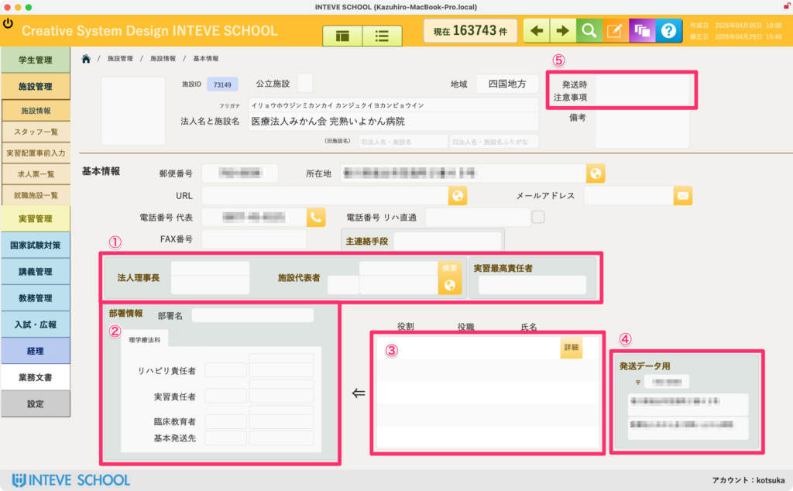

[← 施設管理ポータルに戻る](施設管理ポータル.md) | [メインページ](top.md)

# 施設情報 基本情報

## 🏢 施設情報 基本情報の使いかた

**📢 はじめに（登録データについて）** 厚労省に登録されている施設は2026年4月時点で入力済みです（病院・診療所・歯科医院・老人保健施設）。 基本的には既存のデータを検索して使用し、新規登録や情報の修正が必要な場合のみ以下の手順を行ってください。

各施設（病院や法人）の基礎情報、公文書を発送する際の宛先、各部署の責任者を管理する画面です。実習の案内や重要書類を送付する際のマスターデータとなります。

### 👤 ① 法人・施設の責任者情報

施設全体のトップや、公文書（公式な書類）を送る際の宛先を指定します。

- **「法人理事長」「施設代表者」「実習最高責任者」** などの氏名を入力します。
- 💡 **ポイント：** 実習の公文書を送る際、宛先を「理事長」にするか「施設長（代表者）」にするかは施設によって異なります。ここに正しい情報を入れておくことで、宛名の誤りを防ぎます。

### 🩻 ② リハビリ部署の責任者・担当者

学校の学生が直接お世話になる、各専門分野（理学療法科など）の現場責任者を入力します。

- **「リハビリ責任者」「実習責任者」「臨床教育者」** などの担当教員やバイザーの氏名を登録・確認できます。

### 👥 ③ スタッフ一覧

該当施設に所属しているスタッフ（バイザーや卒業生など）の一覧が表示されます。

- *(※スタッフの詳細な管理方法については、こちらの【[スタッフ一覧マニュアルへ](施設情報-スタッフ.md)】をご覧ください)*

### 🏷️ ④ 発送データ用（タックシール体裁）

登録された住所や施設名をもとに、郵送用のタックシール（宛名ラベル）にそのまま印刷される形でのプレビューが表示されます。

- ⚠️ **注意：** この枠内のデータを直接変更すると、施設全体の住所マスターデータが書き換わる場合があります。一時的な配送先変更などのメモは、右上の「⑤ 発送時注意事項」を利用してください。

### 📦 ⑤ 発送時注意事項

実習書類などを発送・準備する際に、教職員間で共有すべき特記事項を入力するフィールドです。

- 「宛先を〇〇宛に変える必要あり」「書類は別館の事務局へ送付すること」など、発送業務のミスを防ぐための重要な申し送り事項を記載します。

---
[← 施設管理ポータルに戻る](施設管理ポータル.md) | [メインページ](top.md)
