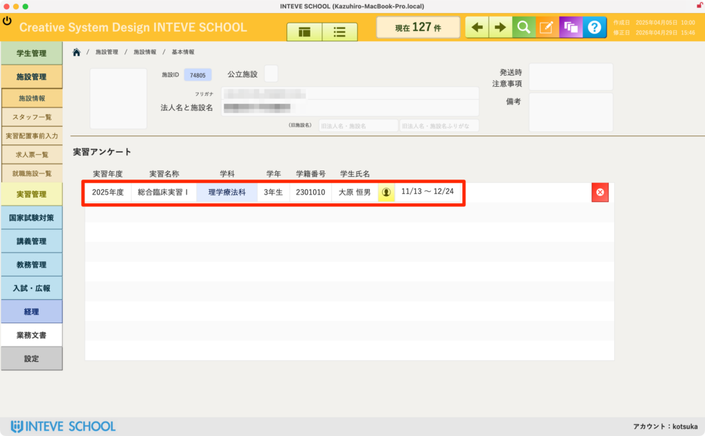

[← 施設管理ポータルに戻る](施設管理ポータル.md) | [メインページ](top.md)

# 施設情報 実習アンケート

## 📋 施設情報 実習アンケートの使いかた

実習終了後、受け入れ施設から得られたフィードバックや感想（アンケート結果）を蓄積・確認する画面です。

💡 **本機能を搭載している理由（養成校の発展のために）：** 多くの学校では、実習が終わるとそのままになりがちで、アンケート自体を実施していないケースも少なくありません。しかし、指導現場からの率直な感想やフィードバックを正しく蓄積し、翌年度の実習運営や学内講義に活かしていくことは、養成校が発展していくために本来必須であると考えます。ぜひ積極的な活用をおすすめします。

### 🛠️ アンケートのカスタマイズについて

現時点では特定のアンケート項目を固定していません。各学校の評価基準や実務の要望に合わせて柔軟にカスタマイズが可能です。

- 📄 **推奨する運用方法（Google フォーム連携）：** 施設への負担軽減や集計の手間を考慮し、**Google フォーム**等で回答してもらったデータを本システムに集約・連動させる形での構築を推奨しています。具体的な項目や連携方法については、導入時のヒアリングにて決定します。

### 🔍 実習アンケート一覧の確認項目

画面中央の赤枠エリアには、過去に実施されたアンケートの概要が以下の項目で一覧表示されます。

- **実習年度・実習名称：** どの年度の、どの実習（例：総合臨床実習Ⅰなど）に対するフィードバックであるかを特定します。
- **学科・学年：** 対象となった学生の所属情報です。
- **学籍番号・学生氏名：** どの学生を受け入れた際のアンケート結果であるかを確認できます。
- **実習期間：** 実際に実習が行われた日程が記録されます。

---
[← 施設管理ポータルに戻る](施設管理ポータル.md) | [メインページ](top.md)
