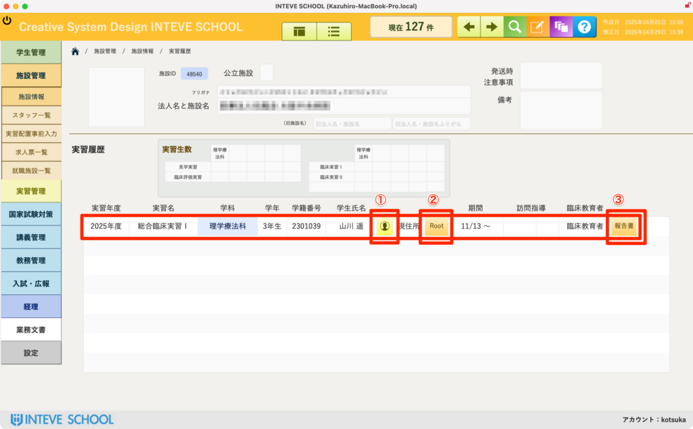
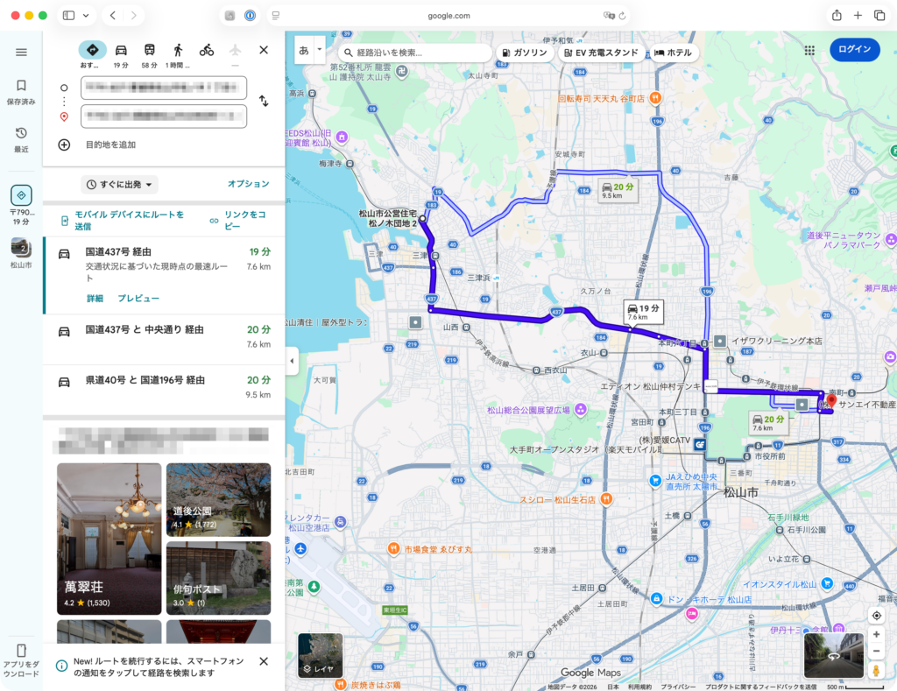
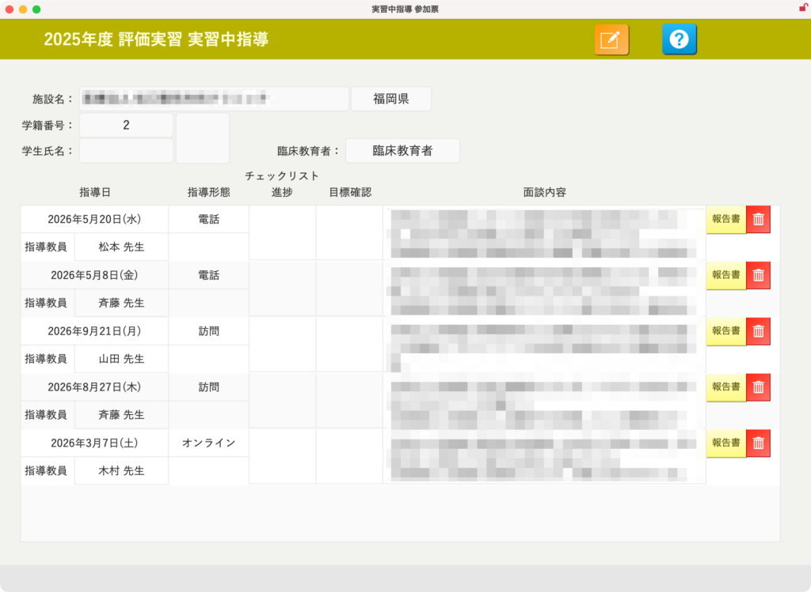

[← 施設管理ポータルに戻る](施設管理ポータル.md) | [メインページ](top.md)

# 施設情報 実習履歴

## ⏳ 施設情報 実習履歴の使いかた

該当施設において、過去に「いつ」「誰が」実習を行ったかという、これまでのすべての実習配属履歴を一覧で確認できる画面です。

### 👤 ① 学生の詳細ページへの移動

一覧の「通」ボタン（または学生名横のボタン）をクリックすると、その学生の「学生情報 詳細ページ」へ直接移動できます。

- 実習中の状況や、学生の個別カルテを急ぎで確認したい場合にスムーズな連携が可能です。

### 🗺️ ② Googleマップでのルート確認

「Root」ボタンをクリックすると、標準ブラウザが立ち上がり、学生の登録住所から実習施設までの通勤・通学ルートがGoogleマップ上で自動表示されます。

- 💡 **ポイント：** 学生の配属を検討する際、自宅からの距離や公共交通機関での移動ルート、所要時間を客観的に把握するための重要な判断材料となります。
- ⚠️ **注意：** もしマップが正しく表示されない場合は、学生情報または施設情報の「住所フィールド」が正しく入力されているかマスターデータを確認してください。

### 📝 ③ 実習報告書の確認・閲覧

一覧右端の「報告書」ボタンをクリックすると、該当する実習の終了後に学生や教員が作成した「実習報告書」のレイアウトへ直接移動できます。

- 過去にその施設でどのような指導が行われたか、学生がどんな課題に直面したかなどのフィードバックを簡単に振り返ることができます。

---
[← 施設管理ポータルに戻る](施設管理ポータル.md) | [メインページ](top.md)
