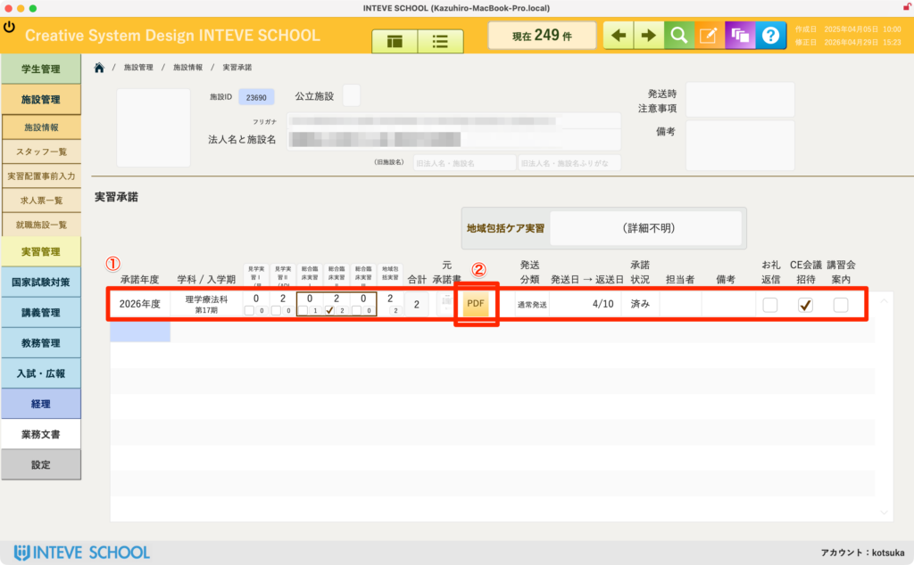
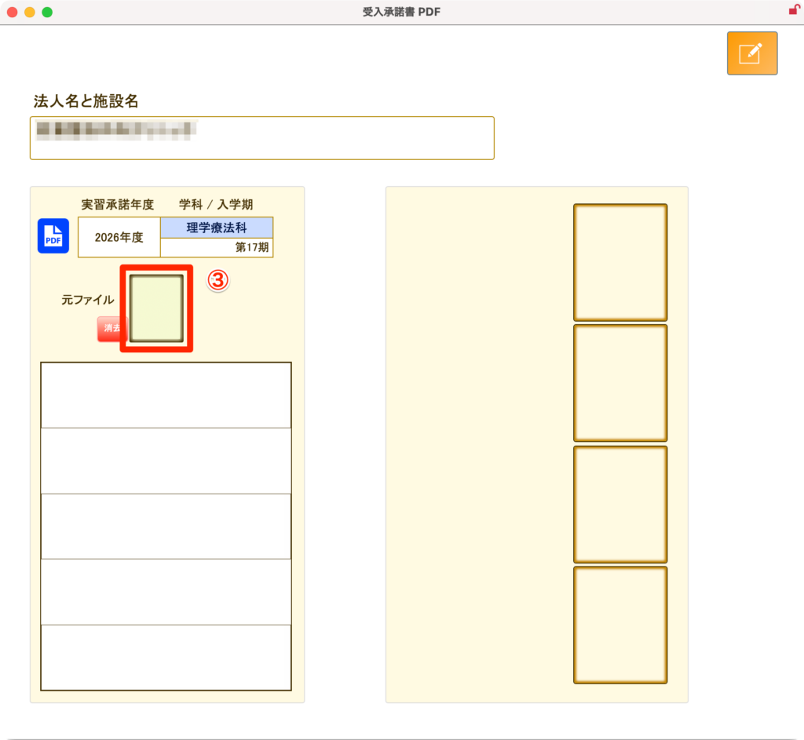
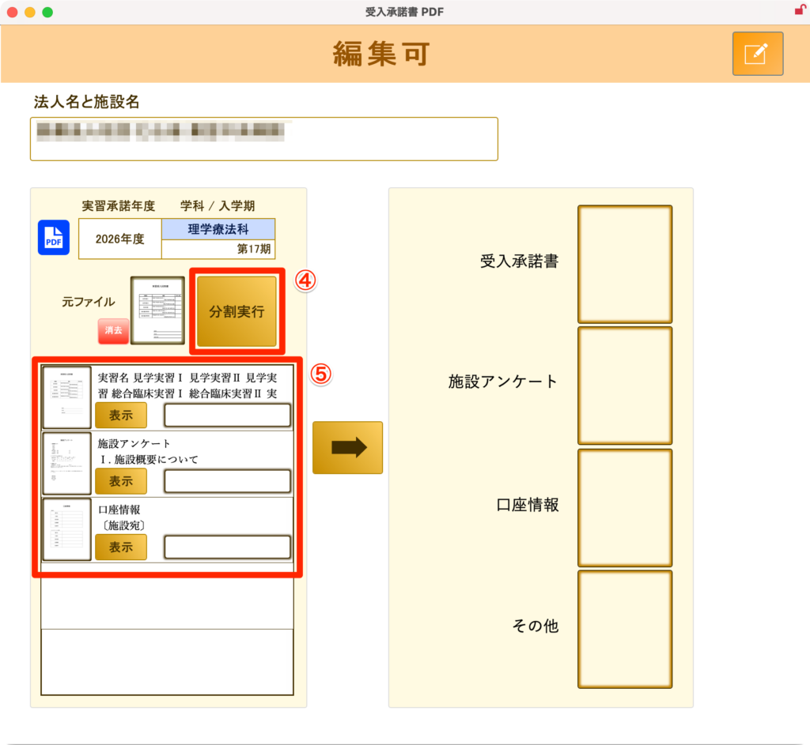
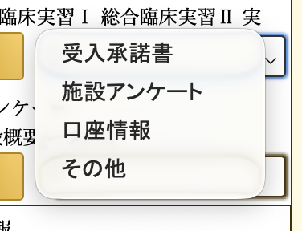
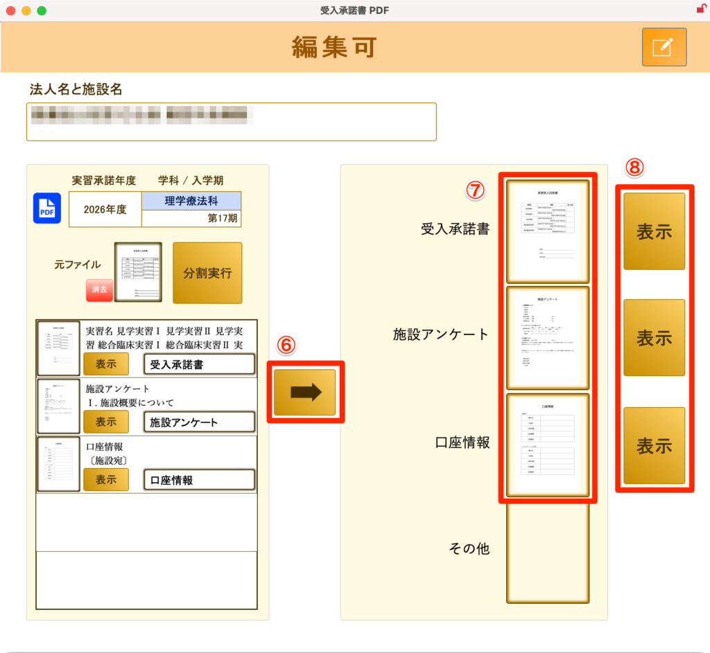
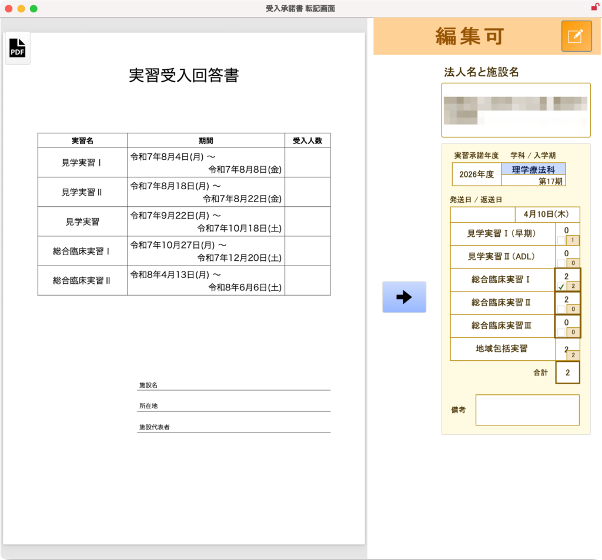
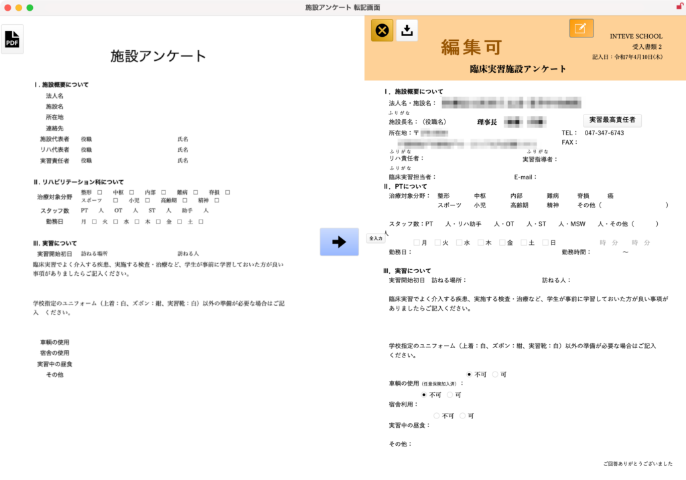
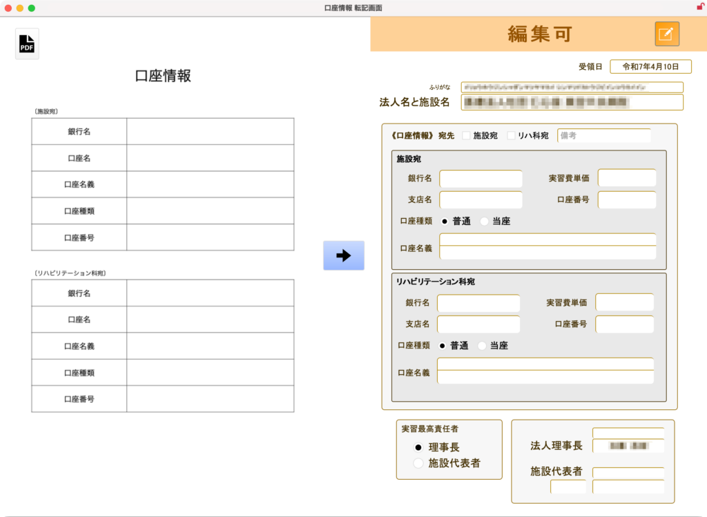
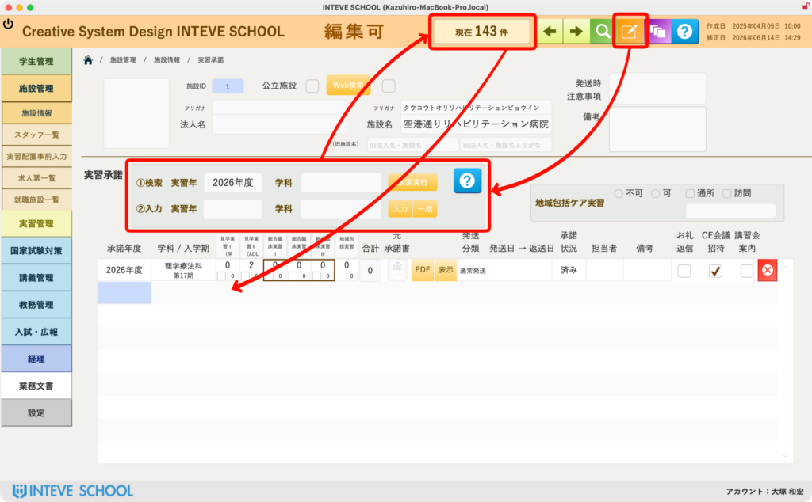

[← 施設管理ポータルに戻る](施設管理ポータル.md) | [メインページ](top.md)

# 施設情報 実習承諾

## 📄 施設情報 実習承諾の使いかた

施設から届く「実習受入の承諾書」や「施設アンケート」などの各種書類をPDFデータとして取り込み、画面上で内容を確認しながら効率よく転記・管理するための画面です。

多くの学校ではいまだに紙でのやり取りが多く、バラバラの書類を見ながらの手動入力に苦労していますが、本機能を使えばペーパーレスかつ正確に入力業務を行うことができます。

### 📊 ① 受入人数の確認・登録

何年の、どの期の実習で、何人の学生を受け入れてもらえるかという数値を管理するエリアです。

- この画面でも直接入力できますが、後に続く専用のレイアウトを使用すれば、より簡潔に一括入力することが可能です。

### 📑 ② 承諾書登録ウインドウの起動

**「受入」**（または該当する起動ボタン）をクリックすると、PDFを取り込んで処理するための専用ウインドウが立ち上がります。

### 📎 ③ 承諾書PDFの取り込み

施設から受領し、スキャナー等で1つのPDFにまとめた書類データをドラッグ＆ドロップ（またはオブジェクトフィールドへの挿入）で貼り付けます。

- 複数ページが1つにまとまったPDFのままで問題ありません。

### ✂️ 🚨 ④ 編集モードへの切り替えと分割実行

取り込んだPDFをページごとに分解する前に、必ず右上の **「編集モードボタン（鉛筆マーク）」** をクリックして編集可能状態にしてください。

⚠️ **注意：** 編集モードになっていない状態では、分割実行ボタンは機能しません。

*(※詳細な手順は【[編集モードの基本操作](編集モードへ.md)】をご覧ください)*

編集モードに切り替えた後、 **「分割実行」** ボタンを押すと、取り込んだPDFがシステム内部で自動的に1ページずつに分割され、下のポータル一覧に展開されます。

### 🔍 ⑤ 内容の確認と文書種類の分類

各ページの **「表示」** ボタンを押すと、そのページの内容を拡大して確認できます。

- 確認後、ドロップダウンメニューから「受入回答書」「施設アンケート」などの文書の種類を選択して分類します。（※選択肢の項目は学校の運用状況に応じてカスタマイズ可能です）

各学校に応じてカスタマイズできます。

### 🛠️ ⑥ ⑦ ⑧ 書類見出しの設定と個別表示

必要な書類の見出しを設定し、**「↓」ボタン（⑥）** を押すことで、**選択した行（⑦）** に自動でデータが紐付けられます。

- 紐付けられた書類は、**個別表示エリア（⑧）** でいつでも即座に確認しながら、以下の実務情報の転記を行えます。

#### 🔹 受入回答書

どの期の実習で何人受け入れてもらえるのか、画面上のPDFを見ながら手動でシステムへ正確に転記しやすくなります。

#### 🔹 施設アンケート

「どんな疾患の患者が多いか」「実習初日の集合場所・時間」「実習前に準備しておくべき学習内容」など、各学校の指定書式や施設の回答内容に合わせてカスタマイズした情報を集約できます。学生への事前指導に欠かせない情報です。

#### 🔹 口座情報

実習費等を振り込むための口座情報を管理します。事務部門との連携だけでなく、教員が実習費管理を兼任している場合でも、PDFの通帳コピーや指定書面を見ながら間違いなく登録作業を行えます。

## 🚀 施設 実習承諾：次年度受け入れ枠の一括自動生成機能（超重要）

### ⚙️ 一括自動生成の完全操作マニュアル

システムが自動で安全に処理を行えるよう、画面は **「通常は隠れており、編集モードに切り替えた時だけ操作エリアが出現する」** という超親切設計になっています。以下の3ステップに沿って慎重に操作を行ってください。

#### **【準備】右上ボタンで「編集可」モードにする**

画面右上にある【鉛筆マーク（編集ボタン）】をクリックし、システム全体を「編集可」の状態に切り替えます。

- 💡 **効果：** 編集モードになると、画面中央に通常は隠れている **「①検索」「②入力」の特設操作エリアが自動的に出現** します！
- ❓ **迷ったら：** 操作エリアの右側にある【青い「？」マーク】をクリックすると、いつでもこのオンラインマニュアルの解説ページへ一撃でジャンプして戻ってくることができます。

#### **【ステップ１】ベースとなる今年度の対象施設を抽出する（①検索）**

まずは「元にする実績データ」を持つ施設を画面上に絞り込みます。

1. 「①検索」の行にある **「実習年（例：2026年度）」** と **「学科」** を指定します。
2. 右側にある **【検索実行】** ボタンをクリックします。
3. ➔ **ココを確認！** 画面最上部にある **【現在 〇〇 件】（対象レコード数）** の数字を確認してください。指定した条件に該当する「今年度実績のある施設」だけが裏側で自動抽出され、画面が綺麗に絞り込まれます。

#### **【ステップ２】新しく作りたい「次年度の条件」を指定する（②入力）**

抽出された施設リストに対して、新しく流し込みたい次年度の枠条件をセットします。

1. 「②入力」の行にある **「実習年」** に、新しく作りたい次の年度（例：2027年度）を半角で入力します。
2. 隣の **「学科」** を指定します。

#### **【ステップ３】次年度のポータルレコードを一括追加する**

条件が整ったら、一括生成の魔法のボタンを押します。

1. 右側にある **【一括】** ボタンをクリックします。
2. ➔ **システムが自動処理！** 【ステップ１】で抽出された **すべての対象施設のポータル内へ、指定した次年度（例：2027年度）の新しい承諾行（空レコード）が一撃で一斉追加** されます。
3. 処理が完了したら、右上の鉛筆マークを戻して作業完了です。

---
[← 施設管理ポータルに戻る](施設管理ポータル.md) | [メインページ](top.md)
