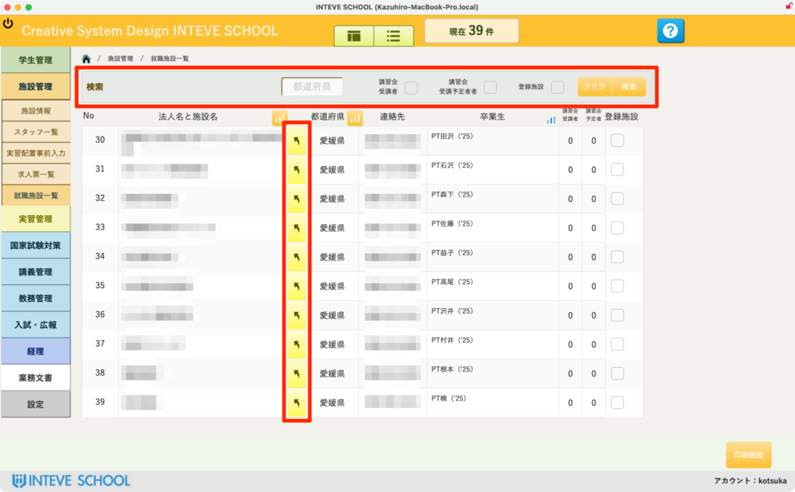
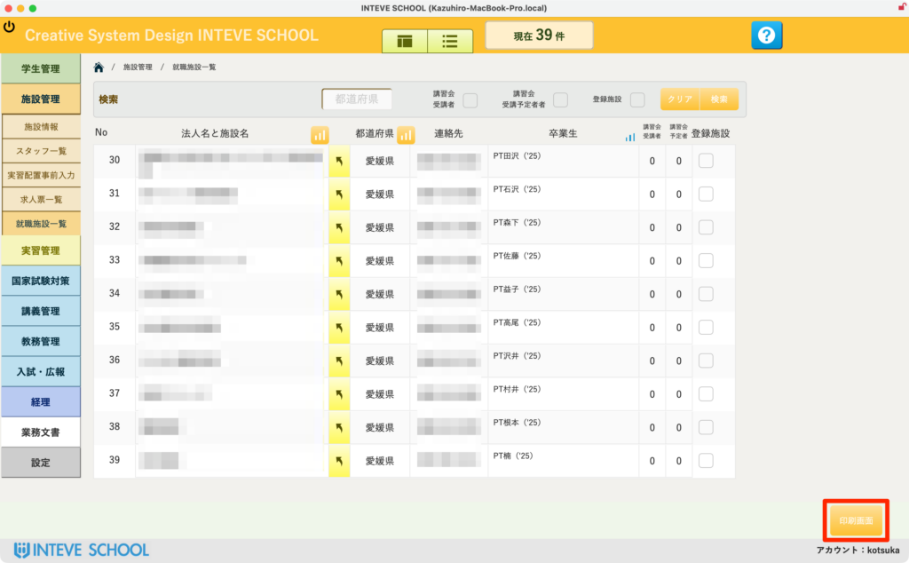
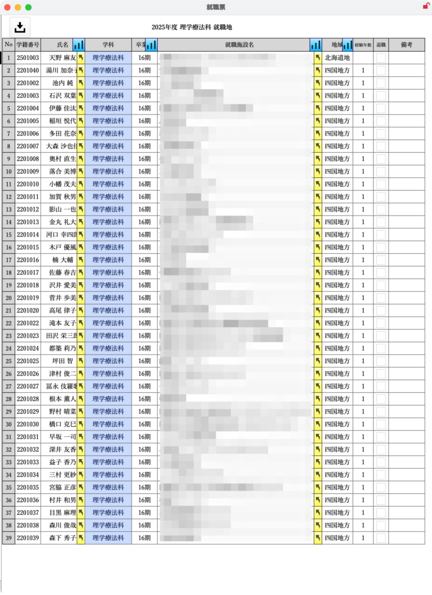

[← 施設管理ポータルに戻る](施設管理ポータル.md) | [メインページ](top.md)

# 施設情報 就職施設 一覧

## 📋 施設情報 就職施設 一覧の使いかた

> 自校の卒業生がどの施設に就職・在籍しているかを全施設横断で検索し、一括で管理・確認する画面です。
> 
> 💡 **本機能のメリット（実習の新規開拓に向けて）：** 臨床実習の受け入れ先を新しく開拓する際、「自校の卒業生が働いているかどうか」は非常に重要な情報となります。身内（卒業生）がいる施設をスピーディに見つけ出すことで、新規の実習依頼や指導者会議へのアプローチを有利に進めることができます。
> 
> ※この画面は **「閲覧および一覧出力」** がメインです。情報の追加や編集は、各施設情報内の個別タブまたは学生管理側から行ってください。
> 
> ### 🔍 1. 就職施設の検索と絞り込み
> 
> 画面上部の検索エリア（赤枠上部）を使って、卒業生の在籍状況を柔軟に絞り込むことができます。
> 
> - **氏名・施設名・区分・学科：** 条件を指定して右端の「検索」ボタンをクリックします。全件表示に戻したい場合は「クリア」をクリックしてください。

### 🔀 2. 詳細ページへのジャンプ

- リスト中央にある **「黄色い矢印ボタン」**（赤枠部分）をクリックすると、該当する施設や卒業生の詳細画面へ直接ジャンプし、より細かな情報を確認できます。

### 🖨️ 3. 印刷画面と一覧PDF出力

画面右下にある **「印刷画面」** ボタン（画像2枚目のオレンジ枠）をクリックすると、そのままA4用紙への印刷やPDF出力が可能な専用レイアウト（画像3枚目）へ移動します。

- ⚠️ **出力時の注意点（対象レコードの確認）：** 印刷されるリストは、**「現在画面上で絞り込まれているデータ」のみが対象**となります。特定の学科や特定の地域の卒業生だけをリスト化して会議等に持ち出したい場合は、事前に検索を行ってから「印刷画面」へ進んでください。

---
[← 施設管理ポータルに戻る](施設管理ポータル.md) | [メインページ](top.md)
