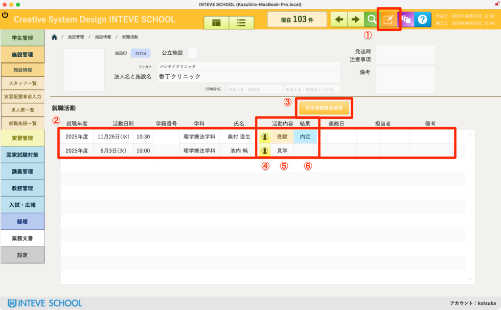
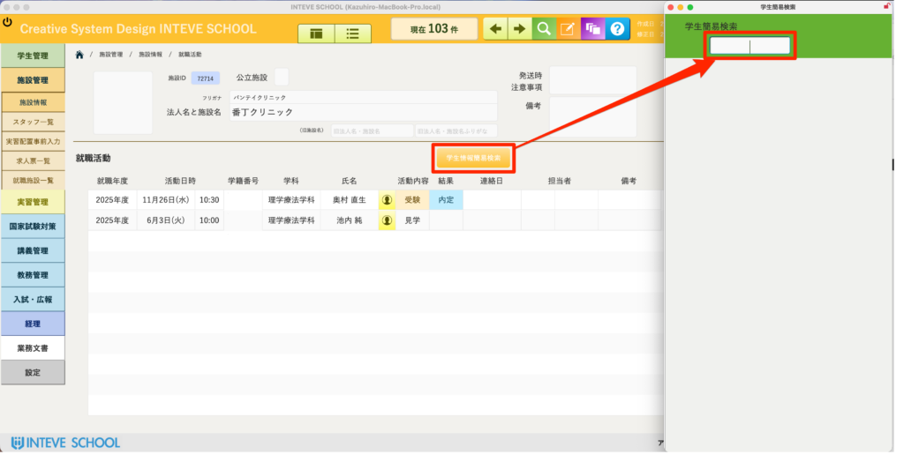
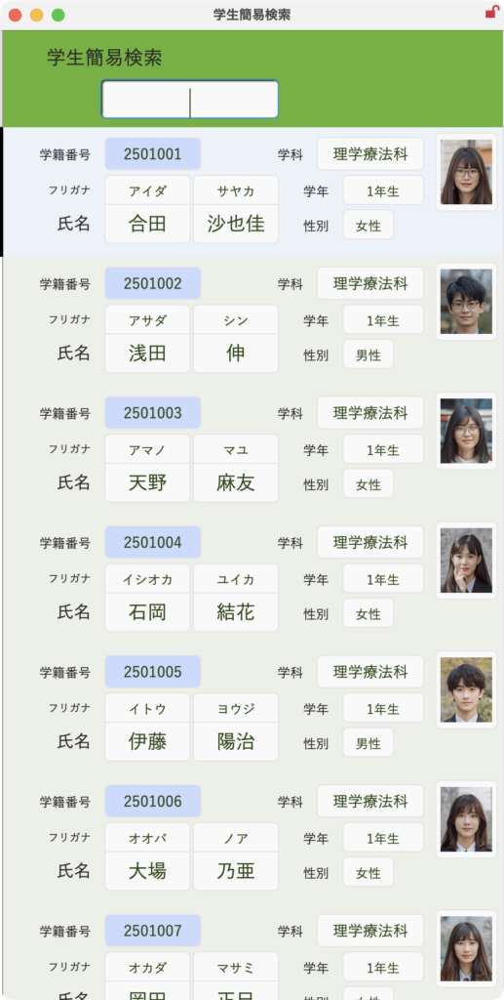
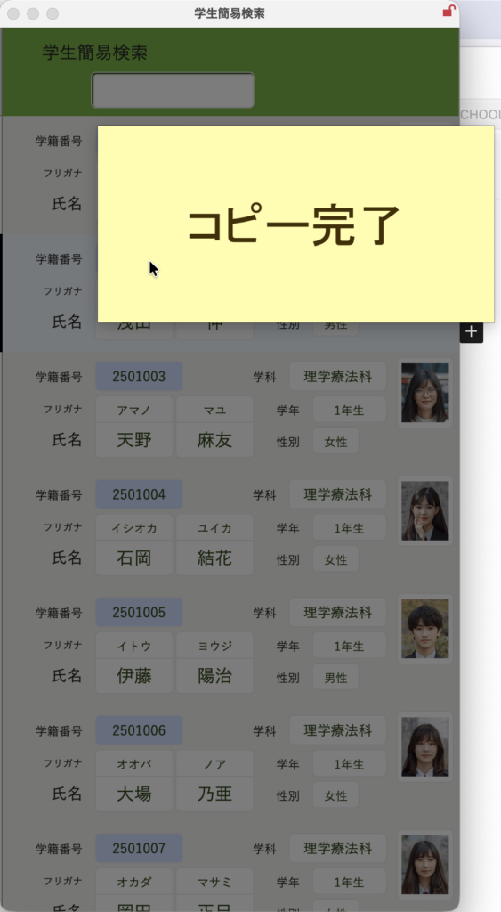
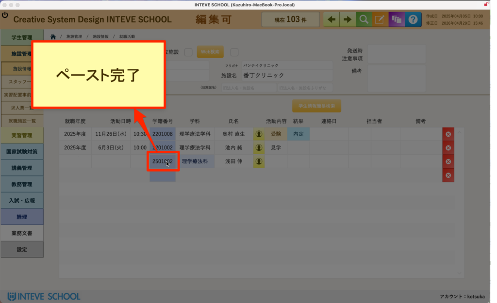

[← 施設管理ポータルに戻る](施設管理ポータル.md) | [メインページ](top.md)

# 施設情報 就職活動

## 💼 施設情報 就職活動の使いかた

該当施設に対して、どの学生が「いつ」「どのような就職活動（見学・試験など）」を行い、「どのような結果」になったかという履歴を管理・確認する画面です。

🚨 **【重要】編集を行う前の必須操作** この画面で就職活動レコードを追加・修正する場合は、必ず画面右上にある **「編集モードボタン（鉛筆マーク）」** をクリックして、編集可能状態に切り替えてから操作を行ってください。

- *(※編集モードの基本的な操作手順は【[編集モードの基本操作](編集モードへ.md)】をご覧ください)*

### 📋 就職活動履歴の概要確認

画面中央の一覧（赤枠エリア）では、以下の項目から各学生の活動概要を一目で把握できます。

- **活動年度・学科・学年・学籍番号・学生氏名（②）：** どの学生のデータであるかを示します。氏名の横にあるボタン（④）をクリックすると、その学生の「学生情報 詳細ページ」へ直接移動できます。
- **活動内容（⑤）：** 「見学」「試験」など、具体的な活動フェーズが記録されます。
- **結果（⑥）：** 「内定」「不採用」など、活動の最終ステータスを管理します。

※全施設を横断して就職活動を一覧・検索したい場合は、専用の管理画面があります。詳細は **【[就職活動一覧マニュアル](学生情報-就職活動-一覧.md)】** をご覧ください。

### 🔍 学生情報の登録手順（コピー＆ペースト機能）

履歴に新しい学生を追加する際、手入力をなくし、簡易検索からボタン操作だけで安全に学籍番号を登録できる仕組みを掲載しています。

**学生情報簡易検索を開く**

- 右上にある「学生情報簡易検索」ボタンをクリックすると、画面右側に検索用のウインドウが開きます。

**学生を検索して学籍番号をコピーする**

- 検索窓に学生名などを入力して対象者を絞り込みます。
- 該当する学生の **「学籍番号（青いボタン）」** をクリックします。画面に **「コピー完了」** と表示され、システムに対象学生のIDが記憶されます。
- ⚠️ **注意：** コピー完了後は、他の文字をコピーしたり画面を閉じたりせず、そのまま次のペースト操作へ進んでください。

**元のレイアウトへペーストする**

- 元のレイアウト（就職活動一覧行）の学籍番号入力欄をクリックします。
- 画面に **「ペースト完了」** と表示され、学生の氏名や所属情報が自動的に紐付けられます。

---
[← 施設管理ポータルに戻る](施設管理ポータル.md) | [メインページ](top.md)
