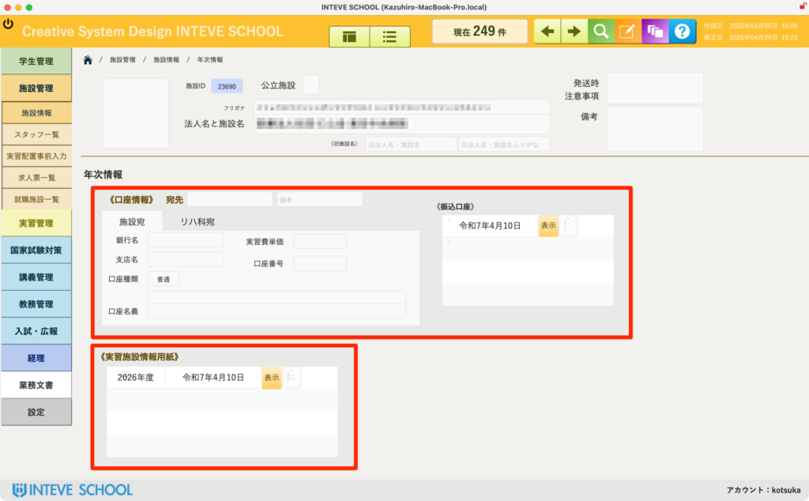

[← 施設管理ポータルに戻る](施設管理ポータル.md) | [メインページ](top.md)

# 施設情報 年次情報

## 📅 施設情報 年次情報の使いかた

該当施設における「口座情報」や「実習施設情報用紙」など、年度ごとに管理される情報を一覧で確認・管理する画面です。

💡 **効率よく作業するための重要なポイント：** この画面からでも直接データの編集は可能ですが、画面構成上、手動での入力は不便です。新しく書類が届いた際データの入力・転記を行う場合は、PDFを見ながら直感的に作業ができる **【[実習承諾マニュアルへ](施設情報-実習承諾.md)】** の専用画面を強く推奨します。

### 💳 口座情報・振込口座の確認

施設への実習費等の振込先となる銀行名、支店名、口座番号、口座名義、および実習費単価などの情報を確認できます。

- **振込口座ポータル：** 過去から現在に至るまで、その施設に対して設定されている振込先口座の一覧が時系列で表示されます。
- 「表示」ボタンをクリックすることで、登録されている詳細を確認できます。

### 📄 実習施設情報用紙（年度ごとの履歴）

各年度における「実習施設情報用紙」の受領日やステータスを確認・閲覧するエリアです。

- 「表示」ボタンから該当年度の登録内容の詳細を確認できます。過去の受領履歴を振り返る際などに利用します。

---
[← 施設管理ポータルに戻る](施設管理ポータル.md) | [メインページ](top.md)
