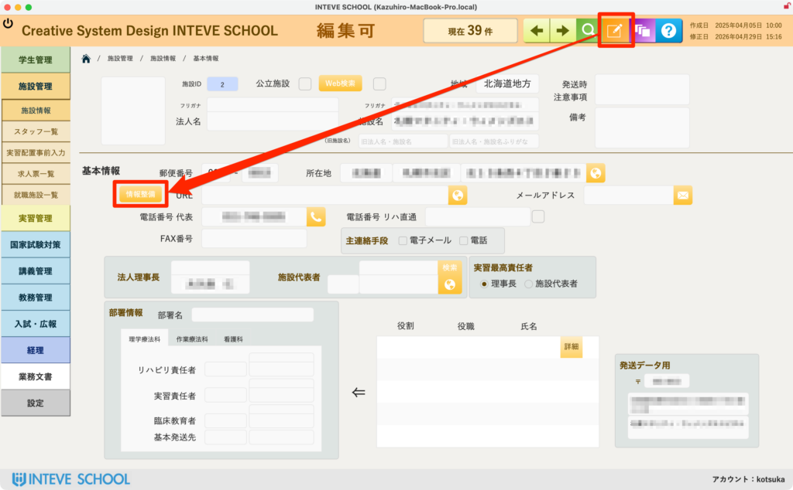
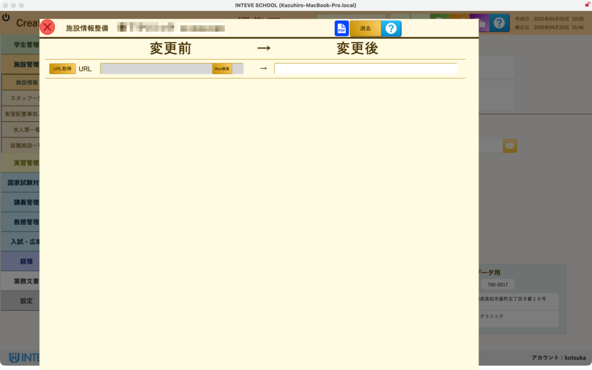
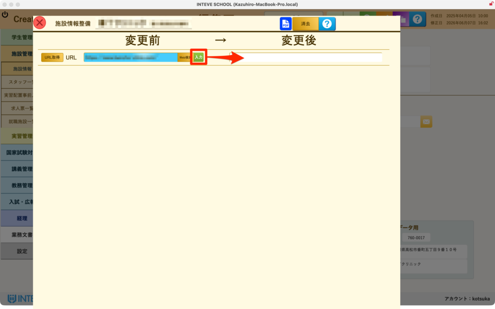
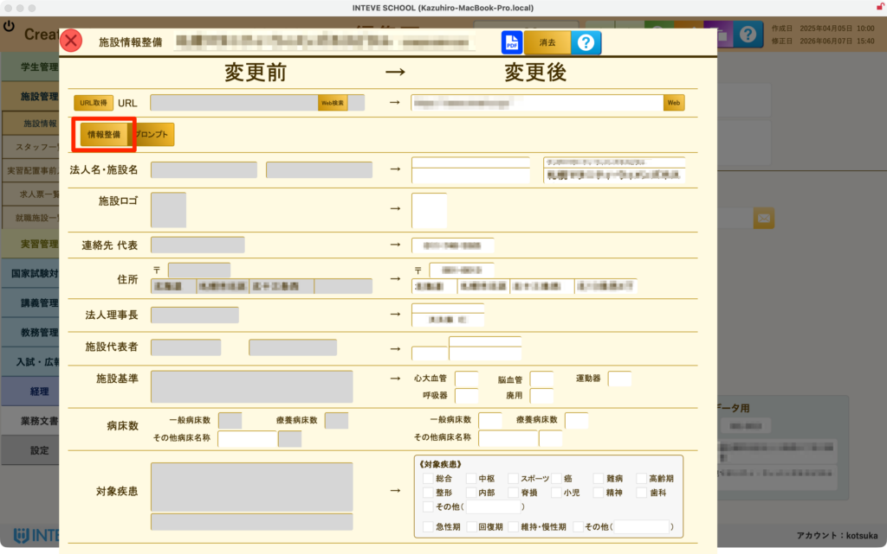
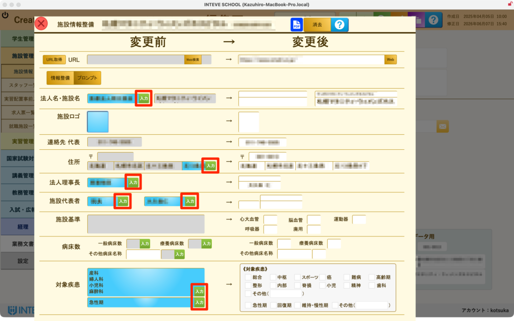

[← 施設管理ポータルに戻る](施設管理ポータル.md) | [メインページ](top.md)

# 施設 情報 情報整備

## 🤖 施設情報 施設情報整備の使いかた

厚労省の基本マニュアルだけでは不足している「実習運営に必要な施設情報」を、AI（外部API）を活用してホームページ等から自動探索し、手入力を最小限に抑えてマスタを最新化する強力な効率化機能です 。

🚨 **【重要】編集を行う前の必須操作**

本画面で情報整備を行う場合は、必ず画面右上にある **「編集モードボタン（鉛筆マーク）」** をクリックして、編集可能状態に切り替えてから操作を行ってください。

- *(※編集モードの基本的な操作手順は【[編集モードの基本操作](編集モードへ.md)】をご覧ください)*

### 🌐 ステップ1：施設の公式WebサイトURLの取得

情報整備を行うための土台となる、施設の「ホームページURL」をAIに探させます。

1. 画面内の **「URL取得」** ボタンをクリックします。
2. AIがインターネット上から該当施設の公式サイトを自動探索します。探索が終わると青いフィールドに候補URLが表示され、同時にブラウザが起動してそのウェブサイトが開きます。
3. 開いたページが該当の施設で間違いなければ、URLの横にある **緑色の「入力」ボタン** をクリックします。右側の正式なURL欄に転記され、その下の詳細情報整備フィールドが展開されます。

### 🔍 ステップ2：AIによる詳細情報の自動探索

URLが確定したら、施設の中身の情報をAIに読み取らせます。

1. **「情報整備」** ボタンをクリックします。 2. AIが指定されたWebサイト内を巡回し、実習管理に必要な住所・電話番号・診療科・施設の特徴などのデータを自動的に抽出します 。しばらくお待ちください。

### 📑 ステップ3：目視確認とマスタへの転記

探索が完了すると、AIが見つけてきた情報が左側の **「青いフィールド」** に一覧で挿入されます。

1. **データの確認：** 青いフィールド内の情報はまだ確定していません。ステップ1で開いた実際のWebサイトと見比べ、情報が正しいか必ず目視で確認してください。
2. **マスタへの転記：** 内容が正しければ、各項目の右側にある **「入力」ボタン**（赤枠部分）をクリックします。右側の白いフィールド（正式マニュアルデータ）へ情報が転記され、登録が完了します。

---
[← 施設管理ポータルに戻る](施設管理ポータル.md) | [メインページ](top.md)
