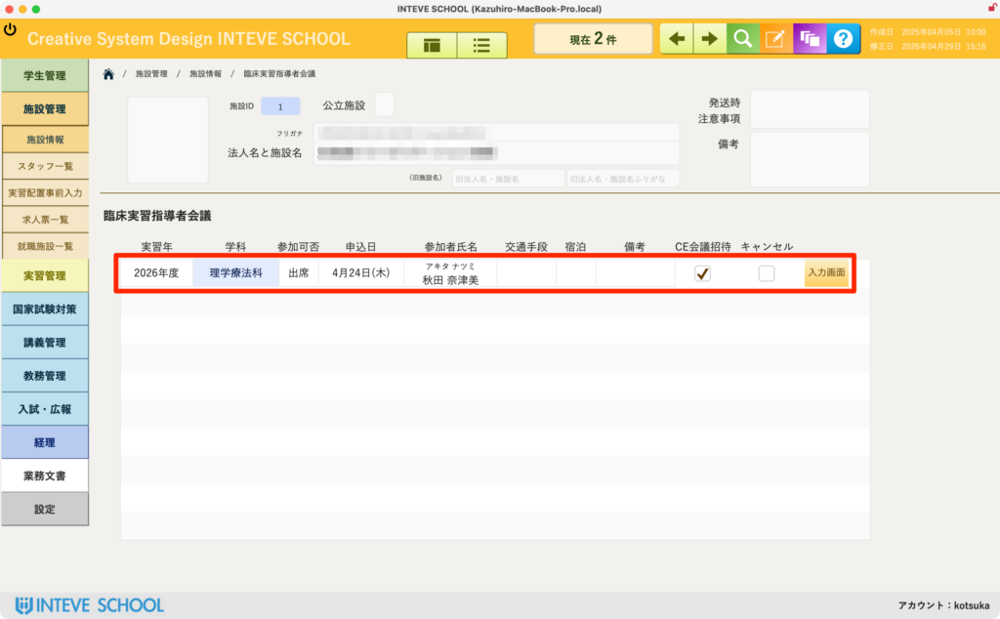
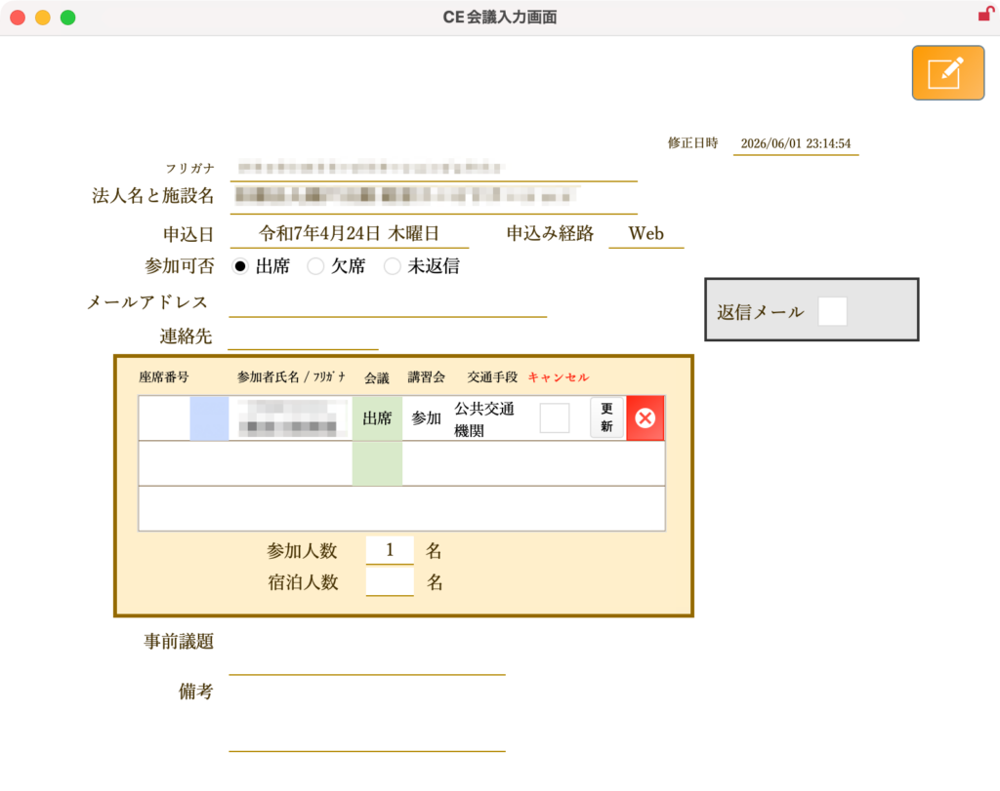

[← 施設管理ポータルに戻る](施設管理ポータル.md) | [メインページ](top.md)

# 施設情報 指導者会議

## 🤝 施設情報 指導者会議の使いかた

該当施設が、学校の開催する「臨床実習指導者会議」に過去いつ参加したか、誰が出席したかという「会議の出欠・参加履歴」を施設ごとに確認する画面です。

💡 **あらかじめ知っておいてほしいこと：** この画面は主に **過去の参加履歴の確認（閲覧）** を目的としています。全施設を対象とした会議への一括入力や詳細な受付処理は別の専用画面で行います。

- *(※全体の入力・受付手順については、こちらの【[指導者会議 一括入力マニュアル](実習管理-指導者会議.md)】をご覧ください)*

### 🔍 臨床実習指導者会議 一覧の確認項目

画面中央の赤枠エリアには、その施設に関連する会議の履歴が時系列で一覧表示されます。

- **実習年・学科：** 何年度の、どの学科（例：理学療法科など）を対象とした指導者会議であるかを確認できます。
- **参加可否・申込日：** 「出席」「欠席」などのステータスと、先方から申し込みがあった日付が記録されます。
- **参加者氏名：** 施設から誰が会議に来てくれたのか、具体的な氏名を確認できるのが本機能の大きなメリットです。
- **交通手段・宿泊・備考：** 遠方の施設の場合など、個別の手配状況や申し送り事項を確認できます。
- **CE会議招待・キャンセル：** 特定の会議への招待有無や、直前のキャンセル対応の履歴が分かります。

### 🔀 入力画面ボタンについて

右端にある **「入力画面」** ボタンをクリックすると、会議全体の詳細な入力・編集を行う専用レイアウトへ移動します。

---
[← 施設管理ポータルに戻る](施設管理ポータル.md) | [メインページ](top.md)
