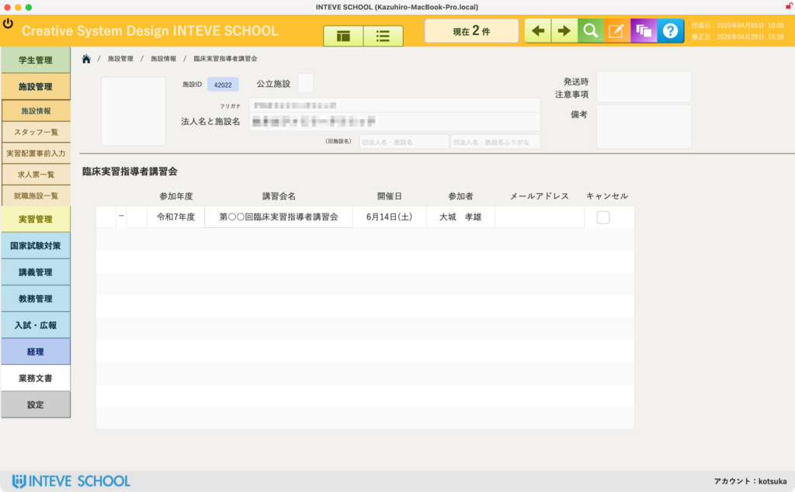

[← 施設管理ポータルに戻る](施設管理ポータル.md) | [メインページ](top.md)

# 施設情報 指導者講習会

## 📜 施設情報 指導者講習会の使いかた

該当施設に所属するスタッフが、過去にどの「臨床実習指導者講習会」に参加したか、という受講履歴を施設ごとに一覧で確認する画面です。

🚨 **【重要】この画面の仕様について** この画面は **「完全な閲覧専用（確認用）」** です。データの追加や修正などの編集作業はここからは一切行えません。

- データの新規登録や修正を行いたい場合は、一括管理用の専用画面から行います。詳細は **【[指導者講習会 受付・管理マニュアル](実習管理-指導者講習会.md)】** をご覧ください。

### 🔍 臨床実習指導者講習会 一覧の確認項目

画面中央のエリアには、その施設に関連する講習会の受講履歴が時系列で一覧表示されます。

- **参加年度：** スタッフがどの年度の講習会に参加したかを確認できます。
- **講習会名：** 参加した講習会の正式名称が記録されます。
- **開催日：** 講習会が実施された具体的な日付です。
- **参加者：** その施設から誰が受講したのか、スタッフの氏名を確認できます。
- **メールアドレス：** 受講したスタッフの連絡先アドレスです。
- **キャンセル：** 申し込み後に辞退やキャンセルがあった場合の記録です。

---
[← 施設管理ポータルに戻る](施設管理ポータル.md) | [メインページ](top.md)
