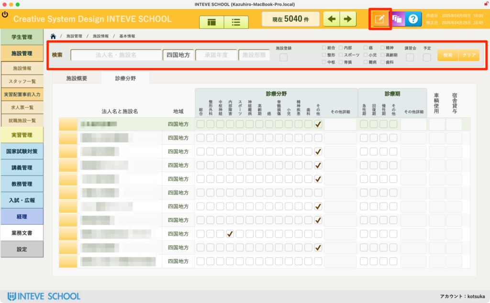
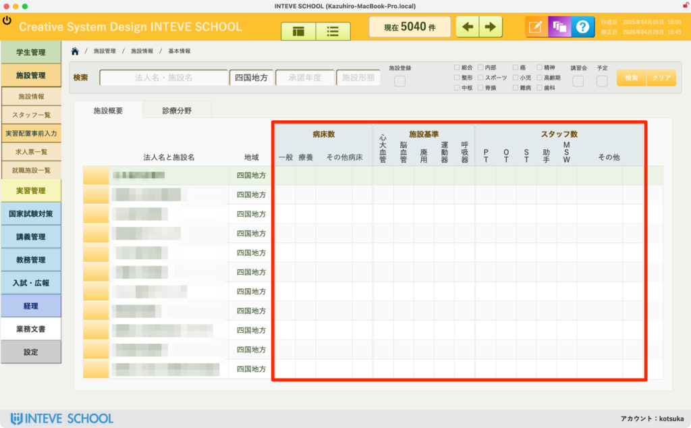
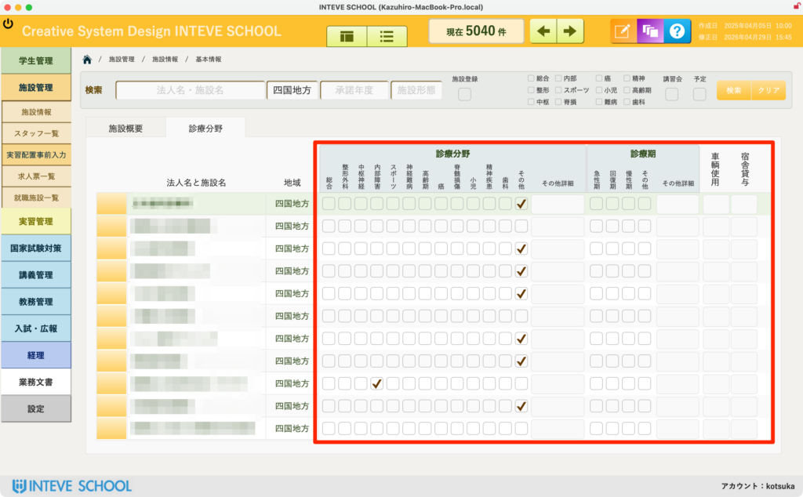

[← 施設管理ポータルに戻る](施設管理ポータル.md) | [メインページ](top.md)

# 施設情報 施設仮配置事前入力

## 🏢 施設情報 施設仮配置事前入力の使いかた

各実習施設における「受け入れ基準（監査用）」および「配置条件（実習配属シミュレーション用）」を一括で登録・編集する画面です。

🚨 **【重要】編集を行う前の必須操作**

本画面でデータの追加・変更を行う場合は、必ず画面右上にある **「編集モードボタン（鉛筆マーク）」** をクリックして、編集可能状態に切り替えてください。

- *(※編集モードの基本的な操作手順は【[編集モードの基本操作](編集モードへ.md)】をご覧ください)*

### 🔍 1. 施設の検索と絞り込み

画面上部の「検索エリア」に条件を入力することで、目的の施設を迅速に一覧表示できます。

- 施設名での部分一致検索のほか、施設区分や特定の条件にチェックを入れて右端の「検索」ボタンを押すことで、対象施設のみを抽出して一括入力へ進めます。

### 📋 2. 「基本概要」タブ：外部監査用データの入力

画面中央のタブを「基本概要」に切り替えると、以下の項目が編集できます。

- **病床数：** 一般、療養、その他病院の規模を示す数値を入力します。
- **施設基準：** 心大血管、脳血管、運動器、呼吸器などの施設認定基準を入力します。
- **スタッフ数：** PT（理学療法士）、OT（作業療法士）、ST（言語聴覚士）などの在籍人数を入力します。
- 💡 **ポイント：** これらのデータは主に、養成校が提出を求められる「外部監査用の書類」の出力元データとなります。漏れなく正確に入力してください。

### 🤖 3. 「実習条件」タブ：実習配置用の条件入力

タブを「実習条件」に切り替えると、自動マッチング機能に直結する項目が編集できます。

- **💡 施設分類：** 「診療分野」「診療期」の該当するマスにチェックを入れます。
- **🚗 施設情報：** 「通勤時の車両使用可否（可/不可）」「宿舎利用可否（有/無）」をそれぞれ設定します。
- 💡 **ポイント：** ここで入力された条件は、「[実習仮配置シミュレーション機能（AIマッチング）](実習管理-実習仮配置.md)」が最適な配置案を算出する際の計算ロジックに直接使用されます。未入力の場合、正しいシミュレーション対象から除外されるためご注意ください。

---
[← 施設管理ポータルに戻る](施設管理ポータル.md) | [メインページ](top.md)
