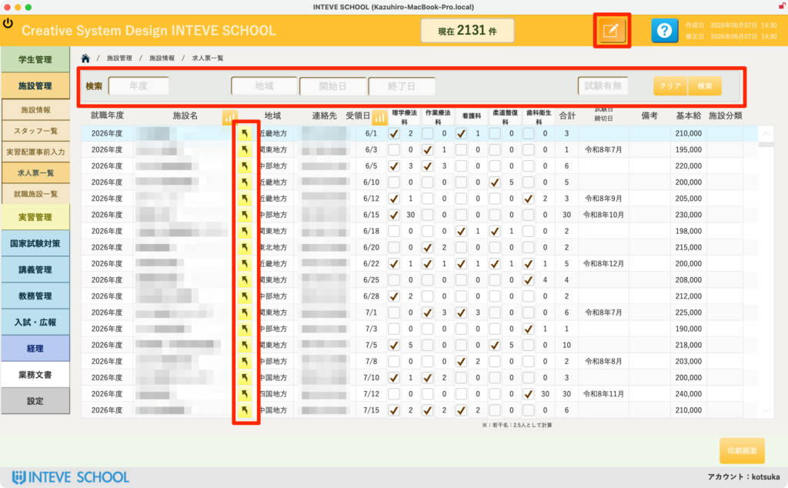
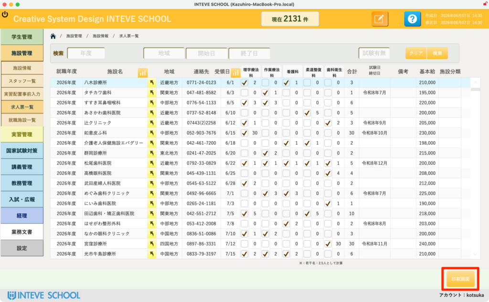
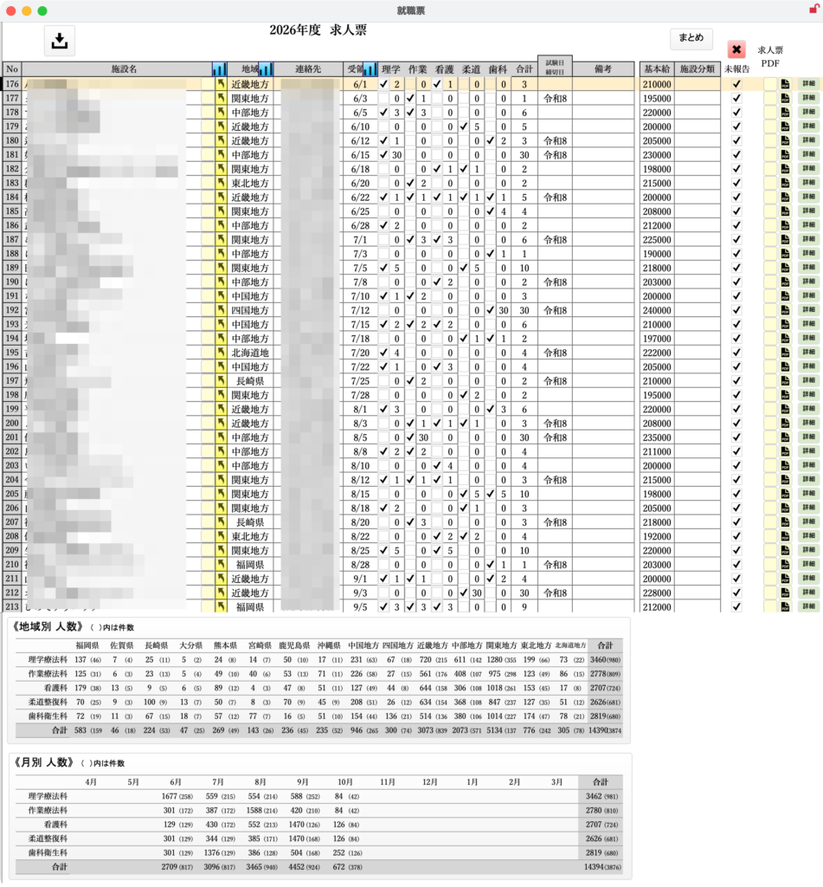

[← 施設管理ポータルに戻る](施設管理ポータル.md) | [メインページ](top.md)

# 施設情報 求人票 一覧

## 📋 施設情報 求人票 一覧の使いかた

全施設から届いた求人票の情報を年度や地域ごとに横断検索し、一括で管理・確認する画面です。

🚨 **【重要】編集を行う前の必須操作** 一覧上で直接データを修正・入力する場合は、必ず画面右上にある **「編集モードボタン（鉛筆マーク）」** をクリックして、編集可能状態に切り替えてください。

- ⚠️ 誤操作によるデータ書き換えを防ぐため、作業が終わったら必ず編集モードを解除（閲覧モードに戻す）してください。
- *(※編集モードの基本的な操作手順は【[編集モードの基本操作](編集モードへ.md)】をご覧ください)*

### 🔍 1. 求人票の検索と絞り込み

画面上部の検索エリア（赤枠上部）を使って、必要な求人情報を瞬時に絞り込むことができます。

- **年度・地域・開始日・終了日・試験有無：** 各項目に対象の条件を入力または選択し、右端の「検索」ボタンをクリックします。条件をリセットしたい場合は「クリア」をクリックしてください。

### 🔀 2. 施設詳細ページへのジャンプ（移動）

- 各行の「施設名」の左側にある **「黄色い矢印ボタン」** をクリックすると、その施設の詳細情報画面（求人票タブ）へ直接ジャンプすることができます。詳細な条件を確認・編集したい場合に活用してください。

### 📊 3. 一覧の確認・編集項目

画面中央のリスト（赤枠下部）では、以下の概要を一覧で確認できます。

- **就職年度・施設名・地域・連絡先・受領日：** 求人の基本情報です。
- **学科（理学療法科等）ごとのチェック・合計：** どの学科に対する求人か、また求人人数の合計が表示されます。
- **試験日締切・備考・基本給・施設分類：** 採用試験のスケジュールや条件の概要です。

### 🔀 2. 施設詳細ページへのジャンプ（移動）

- 各行の「施設名」の左側にある **「黄色い矢印ボタン」** をクリックすると、その施設の詳細情報画面（求人票タブ）へ直接ジャンプすることができます。詳細な条件を確認・編集したい場合に活用してください。

### 📊 3. 一覧の確認・編集項目

画面中央のリストでは、以下の概要を一覧で確認できます。

- **就職年度・施設名・地域・連絡先・受領日：** 求人の基本情報です。
- **学科（理学療法科等）ごとのチェック・合計：** どの学科に対する求人か、また求人人数の合計が表示されます。
- **試験日締切・備考・基本給・施設分類：** 採用試験のスケジュールや条件の概要です。

### 🖨️ 4. 印刷画面と地域別・月別集計

画面右下にある **「印刷画面」** ボタン（画像2枚目のオレンジ枠）をクリックすると、そのまま印刷やPDF出力が可能な専用レイアウト（画像3枚目）へ移動します。

- **📁 地域別・月別の自動集計表：** 印刷レイアウトの下部には、現在表示されている求人票データをベースにした「地域別」「月別」の求人数・募集人数の集計表が自動で算出・表示されます。就職動向の分析や、会議資料の作成にそのまま活用できます。
- ⚠️ **出力時の注意点（対象レコードの確認）：** この集計表は、**「現在画面上で絞り込まれている求人票」のみを対象に集計**されます。学校全体の年間集計を出力したい場合は、必ず事前に画面上部の「クリア」ボタンを押し、すべての求人票が表示された状態（全件対象）であることを確認してから「印刷画面」を開いてください。

---
[← 施設管理ポータルに戻る](施設管理ポータル.md) | [メインページ](top.md)
