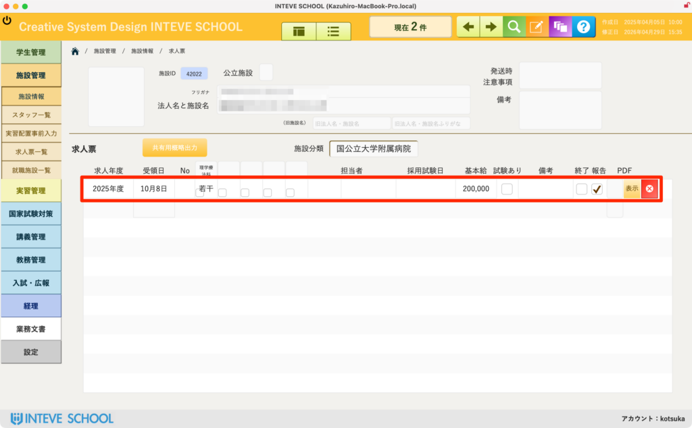
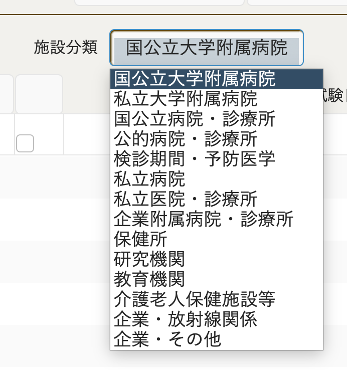

[← 施設管理ポータルに戻る](施設管理ポータル.md) | [メインページ](top.md)

# 施設情報 求人票

## 💼 施設情報 求人票の使いかた

各施設から届いた求人票の情報を登録・確認する画面です。 事務方に頼らず教職員が直接入力することで、学生に対してどこよりも早いタイミングで最新の求人情報を提示できるメリットがあります。

🚨 **【重要】編集を行う前の必須操作** この画面で求人情報を追加・修正する場合は、必ず画面右上にある **「編集モードボタン（鉛筆マーク）」** をクリックして、編集可能状態に切り替えてから入力を行ってください。

- *(※編集モードの基本的な操作手順は【[編集モードの基本操作](編集モードへ.md)】をご覧ください)*

### 📋 求人票一覧の入力・確認項目

赤枠エリアには、年度ごとの求人概要が表示されます。

- **求人年度・受理日：** いつ届いた求人であるかを管理します。
- **求人数・担当者・採用試験日：** 採用に関する具体的な条件です。
- **基本給・試験あり（チェック）：** 学生が最も注目する条件面を一目で把握できます。
- **終了・報告・PDF：** 該当求人の募集が終了したかどうかのステータスや、実際の求人票PDF（受領したもの）の確認・表示をここから行えます。

### 📊 施設分類の設定（集計・分析に必須）

画面中央上部にある **「施設分類」** のドロップダウンメニューから、該当する分類（例：国公立大学附属病院、私立病院、介護老人保健施設等）を必ず選択してください。

- 💡 **ポイント：** ここを正しく入力しておくことで、「今年度はどの分類の施設からの求人が多いか」「学生がどの分類に多く就職しているか」といった、学校独自の重要な就職動向データ・統計を正しく集集計できるようになります。

---
[← 施設管理ポータルに戻る](施設管理ポータル.md) | [メインページ](top.md)
