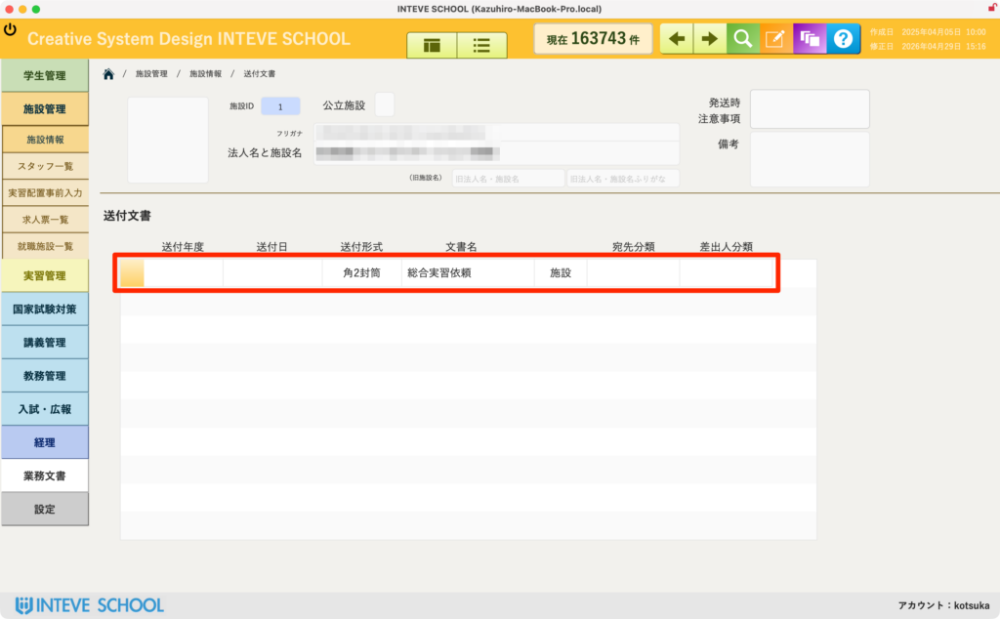

[← 施設管理ポータルに戻る](施設管理ポータル.md) | [メインページ](top.md)

# 施設情報 送付文書

## 📄 施設情報 送付文書の使いかた

該当施設に対して、過去に「いつ」「何を」送付したかの履歴を一元管理・確認する画面です。

💡 **あらかじめ知っておいてほしいこと：** この画面は主に **過去の送付履歴の確認（閲覧）** を目的としています。実際の文書の作成や発送処理の手順については、複数の処理方法があるため別ページにて解説します。

### 📋 送付文書履歴一覧の確認項目

赤枠で囲まれた一覧では、以下の情報が時系列で記録されます。発送トラブルや「届いている・届いていない」の確認が必要になった際は、まずこの履歴を参照してください。

- **送付年度：** どの年度の業務（実習など）に関連して送付されたものかを確認できます。
- **送付日：** 実際に書類を発送・確定した日付です。
- **送付形式：** 「角2封筒」「長3封筒」など、どのような形態で送ったかが記録されるため、発送物のサイズを特定できます。
- **文書名：** 「総合実習依頼」など、送付した公文書や書類の具体的な名称です。
- **宛先分類：** 「施設」宛なのか、特定の個人宛なのかといった送付先グループを判別できます。

---
[← 施設管理ポータルに戻る](施設管理ポータル.md) | [メインページ](top.md)
