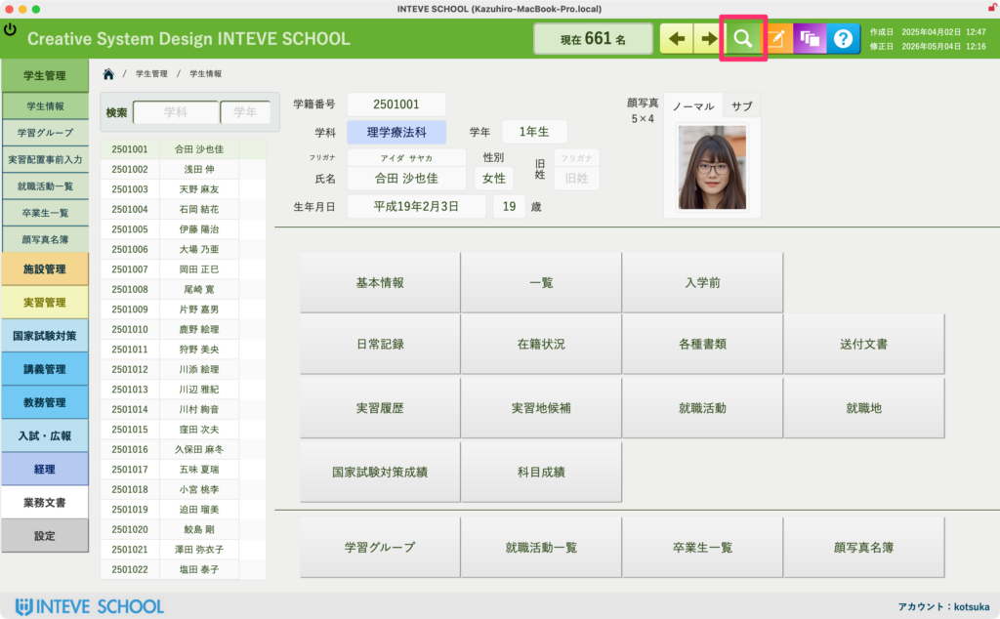
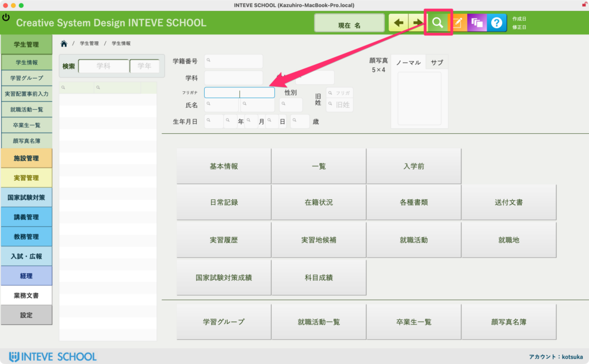
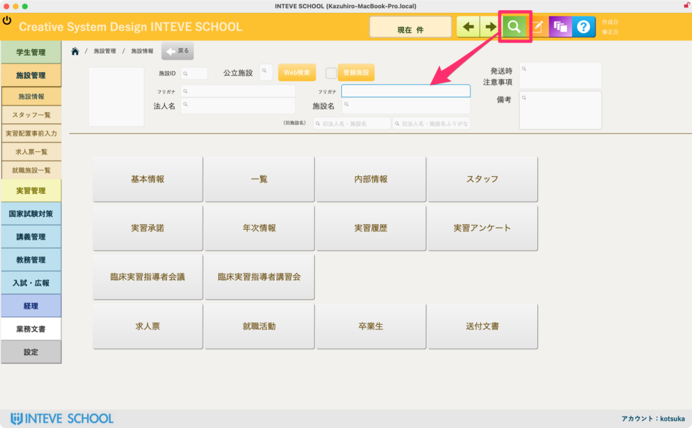

[← 基本的な使い方に戻る](基本的な使い方.md) | [メインページ](top.md)

# 検索モードへ

### データの検索方法（検索モード）

登録されているデータから、目的の情報を素早く探し出すための手順です。主に「学生情報」と「施設情報」のページで利用します。

1. **画面右上にある「虫眼鏡のアイコン（緑色のボタン）」をクリックします。**
2. **ボタンを押すと画面が切り替わり、検索したいキーワードを入力できるようになります。**  
    ※どこか1箇所の入力欄（フィールド）にキーワードを入れるだけで、関連する項目を賢く一括検索してくれます。

#### 💡 入力できるキーワードの例

- **学生情報の場合：**  
    「氏」「名」「氏名（姓名）」「氏フリガナ」「名フリガナ」のいずれを入力しても検索可能です。
- **施設情報の場合：**  
    「法人名」「施設名」「法人名＋施設名」「法人名フリガナ」「施設名フリガナ」「旧法人名＋施設名」「旧法人名＋施設名フリガナ」のいずれを入力しても検索可能です。

1. **キーワードを入力し終えたら、キーボードの「Return（Enter）」キーを押します。**  
    自動的に検索が実行され、該当するデータが一覧で表示されます。

【学生情報の場合】

【施設情報の場合】

---
[← 基本的な使い方に戻る](基本的な使い方.md) | [メインページ](top.md)
