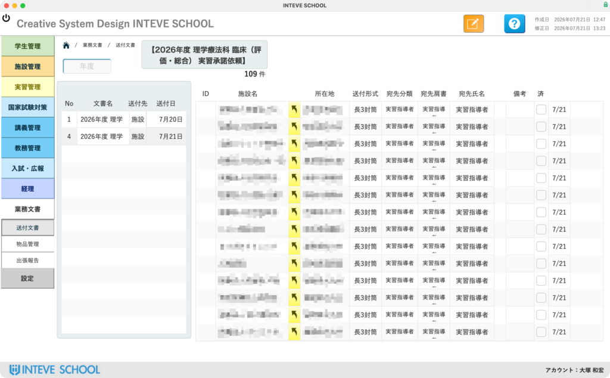
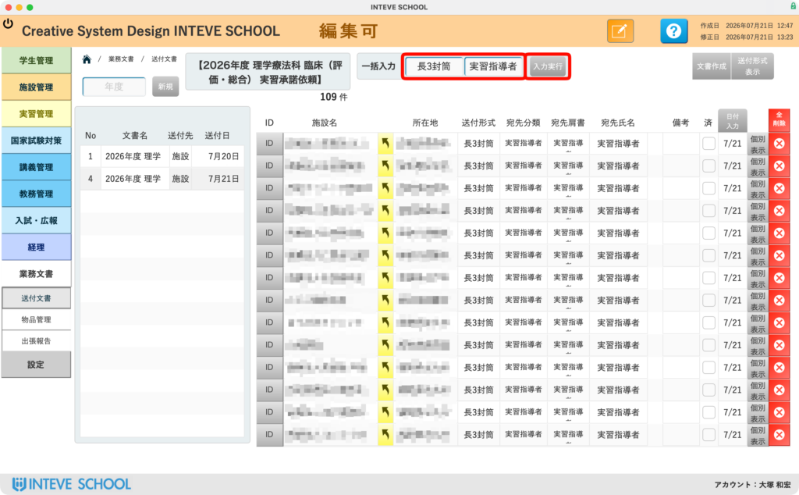
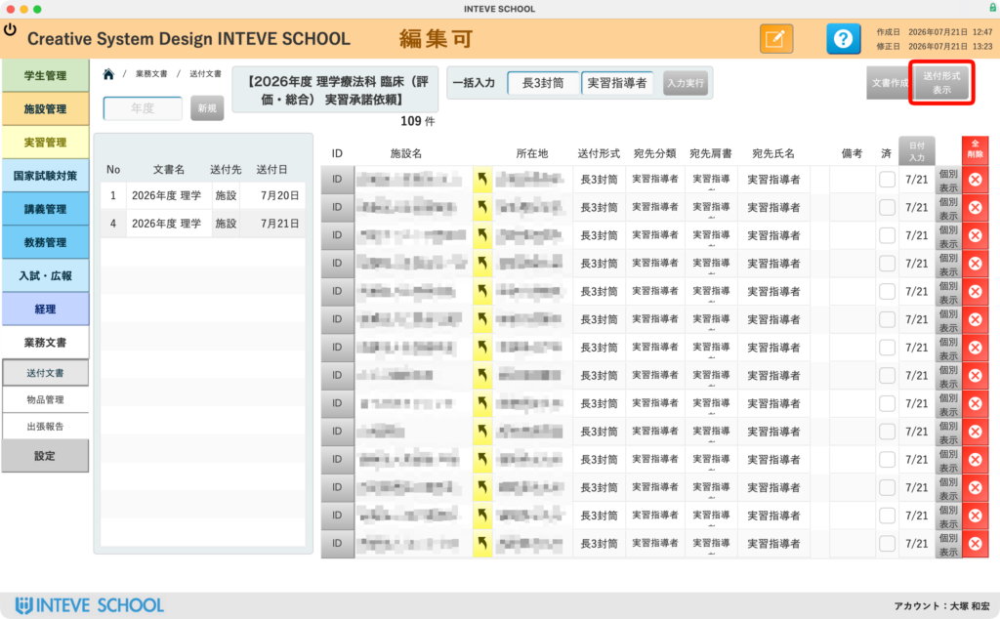
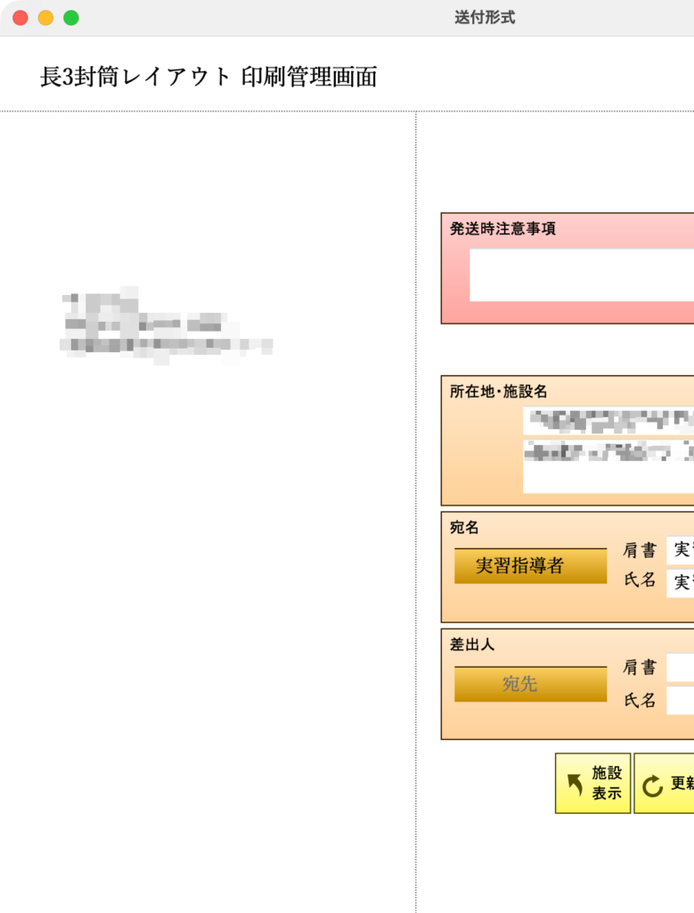
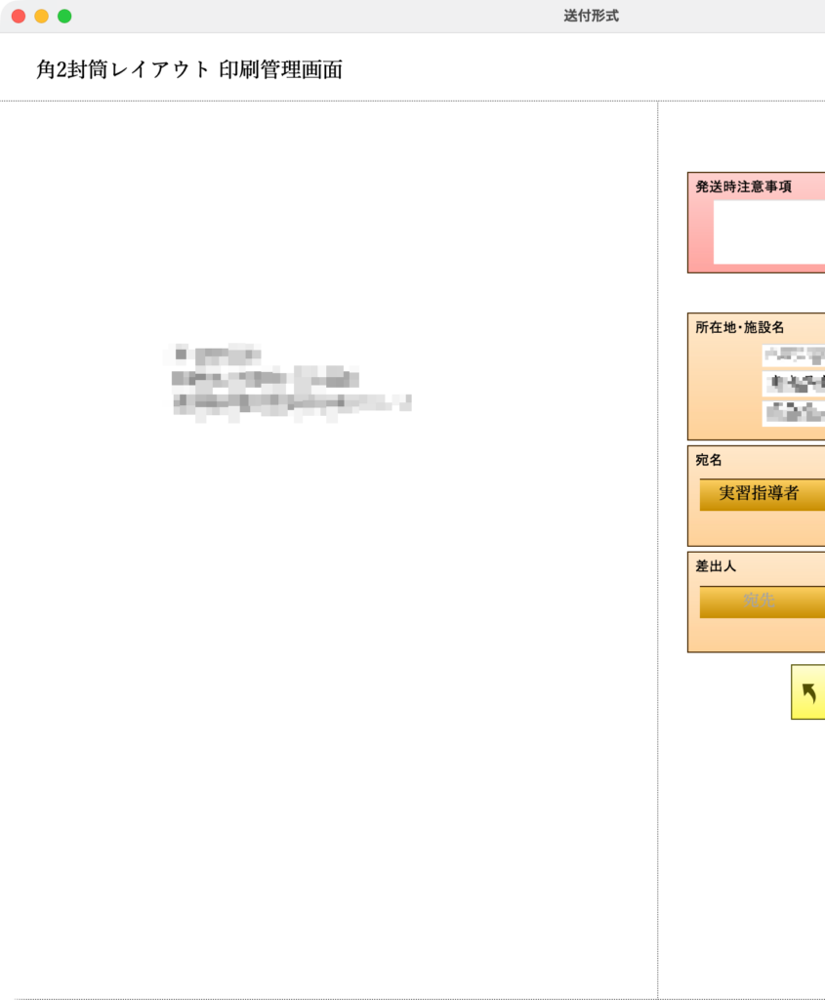

[← 基本的な使い方に戻る](基本的な使い方.md) | [メインページ](top.md)

# 送付文書準備

本画面は、対施設・対高校・対学生など、各種案内や書類の**送付準備を共通のレイアウトで効率よく行える機能**です。

対象となる施設や学生の情報は各画面から自動的に読み込まれるため、**面倒な手入力作業は基本的に不要**です！（※必要に応じて手動での個別追加・編集も可能です）

### 🔍 1. 過去の送付履歴確認と検索（画面左側）

画面左側には、過去に作成・送付したデータの「まとまり（グループ）」が一覧表示されます。

- **過去履歴の検索：** 上部の「年度」フィールドに年度を入力することで、過去の送付履歴をスピーディに絞り込むことができます。

### ⚙️ 2. 送付形式・宛名の一括設定（一括入力機能）

右上の「検索」**ボタンを押すと、画面上部に**「一括入力」ボタンが表示されます。 ここからドロップダウンメニューを選択することで、対象データへ一括で条件を適用できます。

- **送付形式の選択：** `角2封筒` `長3封筒` `ハガキ` `宛名ラベル` などから選択できます。 *(※運用に合わせてカスタマイズが可能です)*
- **宛名の指定：** `リハ責任者` `実習指導者` `施設代表者` `理事長` など、送付先に合わせた肩書きを一括設定できます。 *(※こちらも学校ごとの指定に合わせてカスタマイズ可能です)*

### 🖼️ 3. レイアウトの確認と切り替え

送付設定やデータの整理が完了したら、画面右上にある「送付形式表示」をクリックします。 設定した内容に応じた印刷用レイアウト画面へ移動します。

### ✉️ 4 &amp; 5. 印刷用レイアウトサンプル（長3封筒・角2封筒）

用途に応じた封筒サイズや印刷フォーマットのプレビューが表示されます。

- **長3封筒 / 角2封筒に対応：** 定形封筒の郵便番号枠にぴったり合わせた印字や、宛名の「縦書き / 横書き」切り替えなど、柔軟な印刷設定が可能です。

---
[← 基本的な使い方に戻る](基本的な使い方.md) | [メインページ](top.md)
