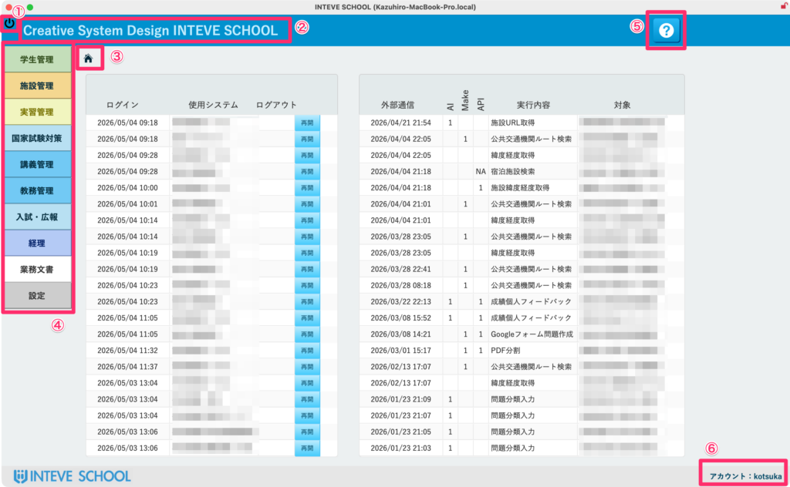
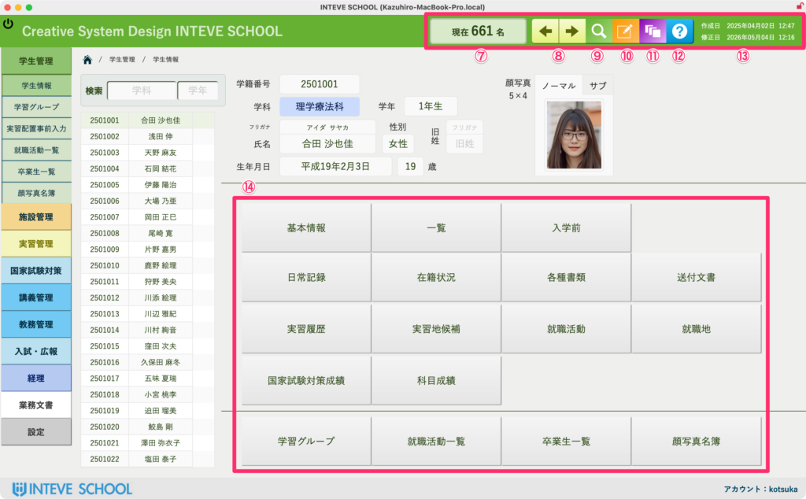
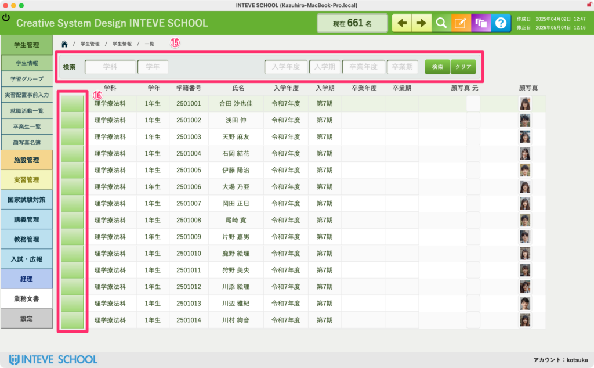
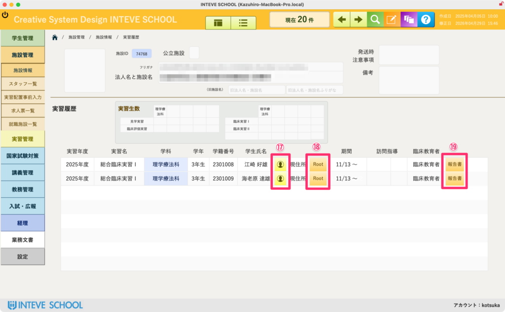

[← 基本的な使い方に戻る](基本的な使い方.md) | [メインページ](top.md)

# 画面の見方

## 画面の基本操作と見方

INTEVE SCHOOLの多くのレイアウトで共通して使用される、基本的なウインドウの見方と機能の解説です。

- **① 閉じるボタン** アプリケーションを安全に終了、または現在のウインドウを閉じます。
- **② ③ ホーム（このレイアウト）に戻るボタン** どの画面からでも、一クリックで現在のメインポータル（ホーム画面）へ戻ることができます。
- **④ 各種機能ボタン** システムの核となるメニューです。※ご契約いただいていない機能はグレーアウトし、選択できないよう制御されています。
- **⑤ Webマニュアルボタン** クリックすると、ブラウザを開いて対象機能のオンラインマニュアルをすぐに確認できます。
- **⑥ ログインアカウント名** 現在システムを操作している方のユーザー名（アカウント名）が表示されます。

**⑦ 対象の総数表示** 一部のレイアウトに表示されます。現在表示している対象（人、施設、件数など）の総数がひと目でわかります。

**⑧ レコード移動ボタン** 表示する対象（レコード）を前後に切り替えるための移動ボタンです。

**⑨ 検索モードへ** \[[検索モードの解説ページへ](検索モードへ.md)\] 特定のデータを絞り込むための検索モードに切り替えます。

**⑩ 編集モードへ** \[[編集モードの解説ページへ](編集モードへ.md)\] データの追加や内容の書き換えを行うための編集モードに切り替えます。

**⑪ 編集ログ表示** \[[編集ログ表示の解説ページへ](編集ログの確認.md)\] 過去の操作ログや変更の履歴を確認する画面を開きます。

**⑫ マニュアル** システム全体の共通マニュアルへアクセスします。

**⑬ 作成日と修正日** 一部のレイアウトに表示されます。そのデータが「いつ作成され、最後にいつ変更されたか」のタイムスタンプです。

**⑭ 詳細機能ジャンプボタン** より詳細な設定や、関連する応用機能のレイアウトへ直接ジャンプします。

**⑮ 検索フィールド** 一部のレイアウトに表示されます。キーワードを入力して対象のデータをその場で検索・抽出します。

**⑯ ポータル内レコード詳細ジャンプボタン** ※「ポータル」とは、1つの画面内に関連する複数のデータ（例：1人の学生に紐づく複数の履歴など）を行一覧として表示する枠のことです。 このボタンを押すと、行内にあるレコードのより詳しい情報画面へジャンプします。

**⑰ ポータル内詳細レイアウトジャンプボタン** ポータル内に表示されているデータをもとに、専用の詳細レイアウト画面へ切り替えます。

**⑱ ⑲ ポータル内機能ボタン** ポータル内の一覧データに対して、個別に特定の処理や計算を実行するためのアクションボタンです。

---
[← 基本的な使い方に戻る](基本的な使い方.md) | [メインページ](top.md)
