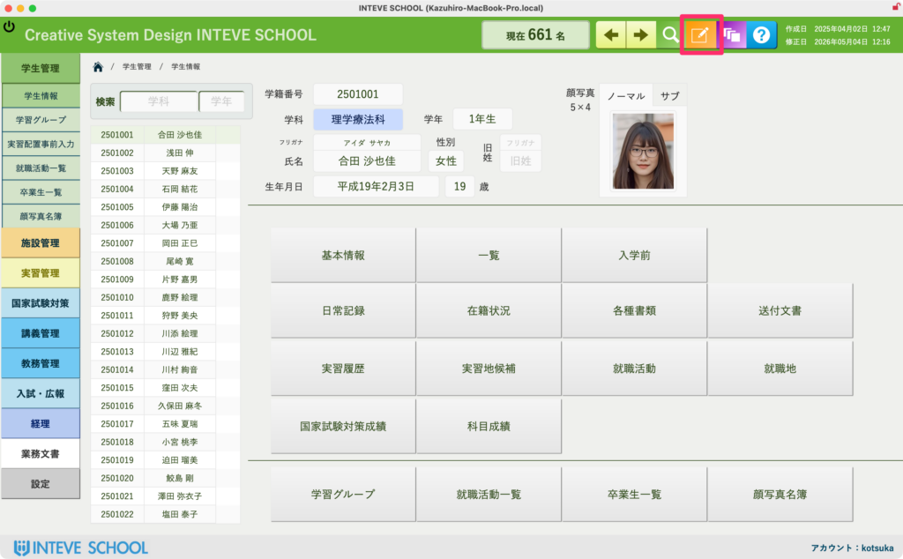
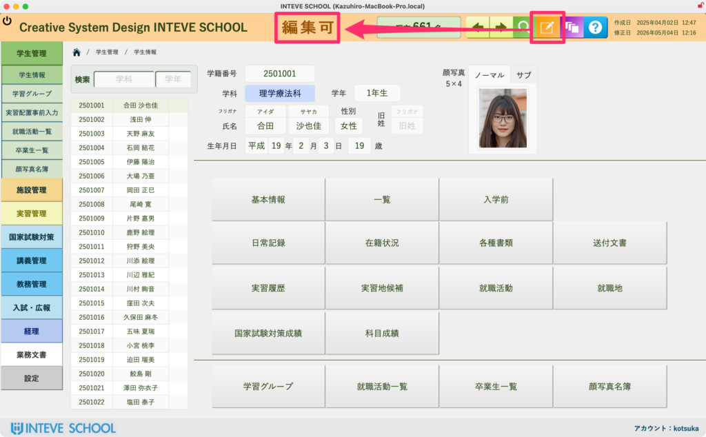

[← 基本的な使い方に戻る](基本的な使い方.md) | [メインページ](top.md)

# 編集モードへ

### 編集モードへの切り替え方法（権限のある方のみ）

データの追加・変更・削除を行うには、画面を「編集モード」に切り替える必要があります。

1. **画面右上にある「オレンジ色のボタン」をクリックします。**  
    ※このボタンは、アカウント権限が「編集可」に設定されている方にのみ表示されます。（「閲覧者」「非対象」の権限の方には表示されません）

2. **ボタンを押すと、ページ上部に「編集可」と赤字で表示されます。**  
    この状態になって初めて、各フィールド（入力欄）の中にカーソルを入れて文字や数字を入力・編集できるようになります。

※ 操作がなく15分経過すると、自動的に通常のモードに戻ります。

---
[← 基本的な使い方に戻る](基本的な使い方.md) | [メインページ](top.md)
