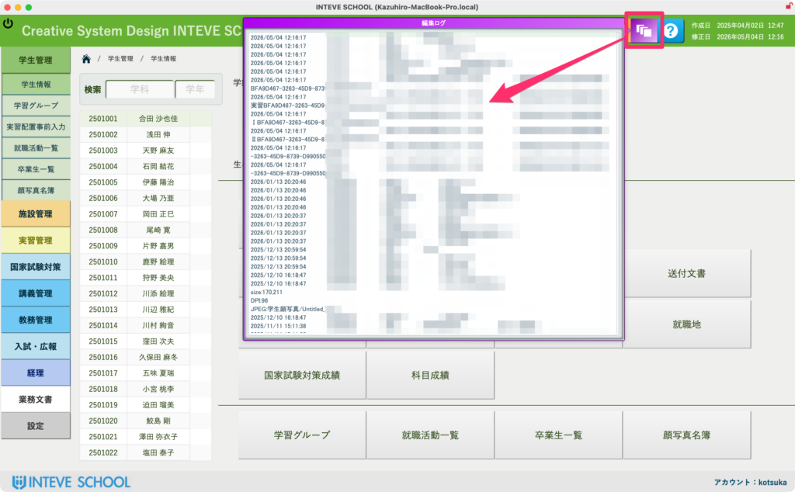

[← 基本的な使い方に戻る](基本的な使い方.md) | [メインページ](top.md)

# 編集ログの確認

### 編集ログ（変更履歴）の確認方法

システムの安全性を保つため、各レイアウトではデータの変更履歴がすべて自動で記録されています。

1. **画面右上にある「紫色のアイコン（重なったシートのマーク）」をクリックします。**  
    ※このボタンは、自動ログ機能が搭載されている対象レイアウトに共通で配置されています。
2. **ボタンを押すと、紫色の「編集ログ」画面がポップアップで表示されます。**  
    ここには「いつ・誰が・どの項目のデータを・どのように書き換えたか」という詳細な履歴がズラリと自動蓄積されています。

※この編集ログ画面は、過去の記録を「確認（閲覧）する専用」の画面です。過去のログ自体を後から編集・削除することはできません。

---
[← 基本的な使い方に戻る](基本的な使い方.md) | [メインページ](top.md)
